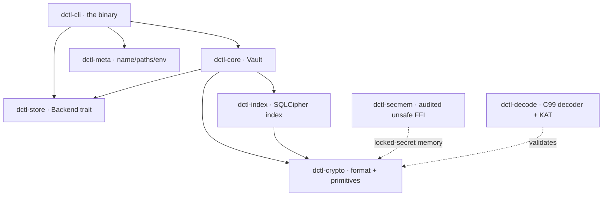

# DCTL

**An rclone-style, streaming-first, post-quantum-ready encrypted multi-cloud transfer, backup, and streaming tool — written in Rust, built so that nothing is ever reported stored until it is provably, durably stored.**

> The name **DCTL** is a working title, centralized in one crate (`dctl-meta`) so
> it can be changed later. On-disk **format identifiers are deliberately
> brand-neutral and frozen** (see [`docs/FORMAT.md`](docs/FORMAT.md)) — renaming
> the product never touches the format, and a vault written today stays readable
> whatever the tool ends up called.

---

## What DCTL is

DCTL moves and stores data across cloud providers the way `rclone` does — `copy`,
`sync`, `cat`, `mount`, familiar filter and addressing rules — but every byte it
writes to a provider is **encrypted client-side** in a frozen, self-describing
format, and every write is **verified at the destination before it is reported as
done**. It is designed around large media (huge videos, disk images) and around a
single hard promise: *a run that says a file is stored is telling the truth.*

**Who it is for.** People who want provider-independent, end-to-end-encrypted
backup and transfer with a durability contract they can audit — homelab and
self-hosting operators, media archivists, and anyone who needs their data to
still decrypt in 20 years and to survive the day a large quantum computer exists.

## Headline guarantees

- **Verified-write** — nothing is reported stored until its bytes are
  checksum-verified at the destination *and* durably committed to the local
  index; a mismatch hard-aborts, deletes the staged object, and commits nothing
  (no half-stored files, no false "copied").
- **Constant-memory streaming** — files of any size upload and download in
  bounded memory via chunked AEAD and constant-memory multipart, so a 50 GB video
  never has to fit in RAM.
- **Cross-device restore** — the backend is authoritative; a fresh machine with
  *only the password* runs `dctl index rebuild vault:` to rescan the backend's
  encrypted name records and reconstruct the path→object map, then restores
  byte-exact. Proven by a real CLI smoke test.
- **20-year restorability** — a dependency-free C99 reference decoder plus
  Known-Answer-Test cross-validation prove the frozen format can be decoded with
  no Rust, no DCTL, and no network far into the future.
- **Post-quantum ready** — the asymmetric sharing layer wraps recipients with an
  X25519 + ML-KEM-768 hybrid (X-Wing-style combiner), giving harvest-now,
  decrypt-later resistance today.

## Feature status

Honest status — `Done` means implemented and exercised, `WIP` means partial or
under active refactor, `Planned` means specified but not built.

| Area | What it is | Status |
|------|-----------|--------|
| **Crypto core** (`dctl-crypto`) | Argon2id (RFC 9106, calibrated), XChaCha20-Poly1305, HKDF-SHA512, BLAKE3, key-committing AEAD | Done (`#![forbid(unsafe_code)]`, unit + property tested) |
| **Frozen v1 format** | DKE1 envelope, DSF1 streaming object, §5 name records — design-locked | Done — see [`docs/FORMAT.md`](docs/FORMAT.md) |
| **Local backend** | `LocalFs` provider, verified writes | Done (fully exercised) |
| **B2 / S3 / R2 backends** | `Backend` trait, constant-memory multipart, presigned uploads | Implemented — **live end-to-end NOT yet verified** (integration tests are `#[ignore]` + env-gated) |
| **Encrypted index** (`dctl-index`) | SQLCipher (bundled), metadata-private, WAL, multi-process | Done |
| **CLI** (`dctl-cli`) | `init`, `copy`/`copyto`/`sync`, `cat`, `ls*`, `verify`, `index rebuild`, … | **WIP** — happy path smoke-tested; some verbs partial, 1 known WIP-failing test |
| **Asymmetric sharing** | `kem_id=1` hybrid recipient wrap, grant sidecars (add/remove without re-upload) | Done (assumes a **shared** backend) |
| **Shared-object discovery** | DGD1 discovery (`discover_shared` / `get_shared`) | Done |
| **Imported keys** | DIK1 imported-key store, multi-identity open | Done |
| **`mount`** | Read-only FUSE mount of a vault: chunk-ranged reads, inferred directories, `EROFS` on every write | Implemented on Linux (FUSE3) and macOS (macFUSE); Windows refuses by name (needs WinFSP). **Attached against a live kernel on macOS**: macFUSE 5.3.3 / macOS 27, mounted, listed, read byte-for-byte including a mid-file seek, writes refused, and unmounted with the mountpoint confirmed free. The Linux path is unit-tested end to end over a real backend |
| **Reference decoder + KAT** (`dctl-decode`) | Dependency-free C99 decoder + cross-validation | Done |

See [`docs/PROJECT_STATUS.md`](docs/PROJECT_STATUS.md) for the current per-area
detail and the full list of known caveats.

## Quick start

Requires a recent stable Rust toolchain (edition 2024, `rust-version = 1.85`;
`rustup update` for the latest).

```sh
# Build the workspace and the `dctl` binary
cargo build --release
export PATH="$PWD/target/release:$PATH"
```

The sequence below mirrors the verified smoke test: create a vault on a local
backend, store a file, read it back, then **throw the index away and rebuild it
from the backend alone** — the cross-device restore path.

```sh
# Password comes from the environment; config + index are kept out of the way
# in a scratch dir so the example is self-contained.
export DCTL_PASSWORD='correct horse battery staple'
D=$(mktemp -d)
FLAGS="--config $D/config.toml --index $D/index.redb"

# 1. Create a vault backed by a local directory.
#    This registers two remotes: `vault:` (sealed/encrypted view) and
#    `vault-store:` (the raw ciphertext objects on the backend).
dctl $FLAGS init --name vault --base "local:$D/store"

# 2. Store a file under an exact name (everything through `vault:` is encrypted).
echo 'hello, encrypted world' > "$D/hello.txt"
dctl $FLAGS copyto "$D/hello.txt" vault:notes/hello.txt

# 3. Read it back to stdout (stdout is byte-exact; progress goes to stderr).
dctl $FLAGS cat vault:notes/hello.txt

# 4. CROSS-DEVICE RESTORE: simulate a wiped machine — delete the local index,
#    then rebuild it from the backend using nothing but the password.
rm "$D/index.redb"
dctl $FLAGS index rebuild vault:

# 5. The path→object map is back. Restore the file byte-exact.
dctl $FLAGS copyto vault:notes/hello.txt "$D/restored.txt"
diff "$D/hello.txt" "$D/restored.txt" && echo "byte-exact restore OK"
```

For unattended jobs, add `--no-ask-password` so a missing credential fails fast
instead of hanging on an invisible prompt. Every global flag (auth sources,
verify modes, filters, output) is documented in
[`docs/GLOBAL_FLAGS.md`](docs/GLOBAL_FLAGS.md).

## Architecture at a glance

Eight crates, layered so the crypto core stays free of `unsafe` and the on-disk
format stays independent of any single backend or CLI.

| Crate | Role |
|-------|------|
| [`dctl-crypto`](docs/CRATES.md) | Frozen v1 format + all primitives; `#![forbid(unsafe_code)]` |
| `dctl-secmem` | The **one** audited home for `unsafe` FFI (mlock/madvise, `LockedSecret`) |
| `dctl-meta` | Single renameable source of app name, paths, and env prefix |
| `dctl-store` | Provider-neutral `Backend` trait + `LocalFs`, `B2`, `S3`, `R2` |
| `dctl-index` | SQLCipher encrypted, metadata-private local index |
| `dctl-core` | `Vault` — composes crypto + store + index (init/unlock, put/get, sharing, restore) |
| `dctl-cli` | The `dctl` binary |
| `dctl-decode` | Dependency-free C99 reference decoder + KAT cross-validation |



See [`docs/ARCHITECTURE.md`](docs/ARCHITECTURE.md) for the full picture and
[`docs/CRATES.md`](docs/CRATES.md) for the per-crate API surface.

## Documentation

| Doc | What it covers |
|-----|----------------|
| [`docs/README.md`](docs/README.md) | Documentation index / map |
| [`docs/ARCHITECTURE.md`](docs/ARCHITECTURE.md) | How the crates fit together |
| [`docs/SECURITY.md`](docs/SECURITY.md) | Threat model, guarantees, and honest limits |
| [`docs/GUIDE.md`](docs/GUIDE.md) | Task-oriented user guide |
| [`docs/CRATES.md`](docs/CRATES.md) | Per-crate roles and APIs |
| [`docs/DEVELOPMENT.md`](docs/DEVELOPMENT.md) | Building, testing, contributing |
| [`docs/FORMAT.md`](docs/FORMAT.md) | Normative, frozen on-disk format spec |
| [`docs/GLOBAL_FLAGS.md`](docs/GLOBAL_FLAGS.md) | Every global flag and env var |
| [`docs/commands/README.md`](docs/commands/README.md) | Per-command reference pages |
| [`docs/EXIT_CODES.md`](docs/EXIT_CODES.md) | Exit-code contract |
| [`docs/ERROR_CODES.md`](docs/ERROR_CODES.md) | FFI-stable error codes |
| [`docs/AUDIT_LOG.md`](docs/AUDIT_LOG.md) | Audit-log format |
| [`docs/PROJECT_STATUS.md`](docs/PROJECT_STATUS.md) | Current status and caveats |
| [`PLAN.md`](PLAN.md) | Vision, locked decisions, roadmap |

## Security summary

DCTL encrypts **both paths and content** client-side under a password-wrapped
root key, uses key-committing AEAD (partitioning-oracle defense), and derives
every subkey from the envelope so losing the envelope makes stored objects
permanently unreadable. Its asymmetric layer is post-quantum hybrid
(X25519 + ML-KEM-768).

Known limits, stated up front: there is **no forward secrecy** against
root-/recipient-key compromise (static-recipient at-rest, by design); **no sender
authentication** in v1 (confidentiality + integrity, not origin auth); the
sharing graph and object sizes are **metadata surfaces** visible to the backend;
`--key-file` (second factor) is **not yet supported** and is refused rather than
silently ignored. Full threat model in [`docs/SECURITY.md`](docs/SECURITY.md).

## Build & test

```sh
cargo build                                   # workspace
cargo test                                    # unit + property tests
cargo clippy --all-targets -- -D warnings     # lints as errors
cargo +nightly fuzz run stream_open           # from crates/dctl-crypto/fuzz
```

Live B2/S3/R2 integration tests are `#[ignore]` and gated on credential env vars
(`DCTL_B2_KEY_ID`, `DCTL_S3_*`, `DCTL_R2_*`); they are not part of the default
`cargo test` run and have **not** been verified end-to-end yet.

## License

Proprietary. See [`Cargo.toml`](Cargo.toml) (`license = "Proprietary"`).
