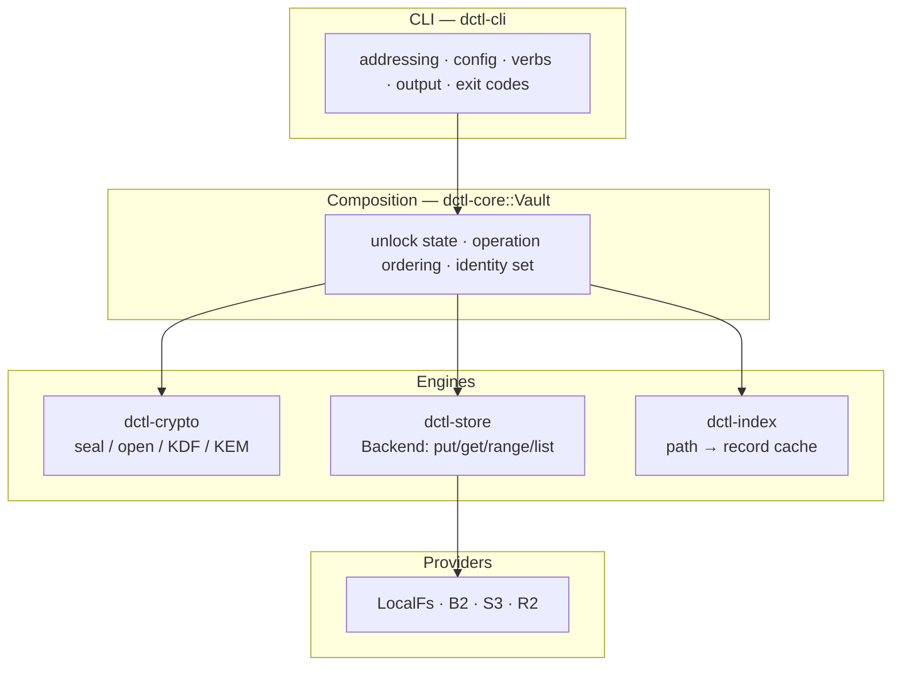
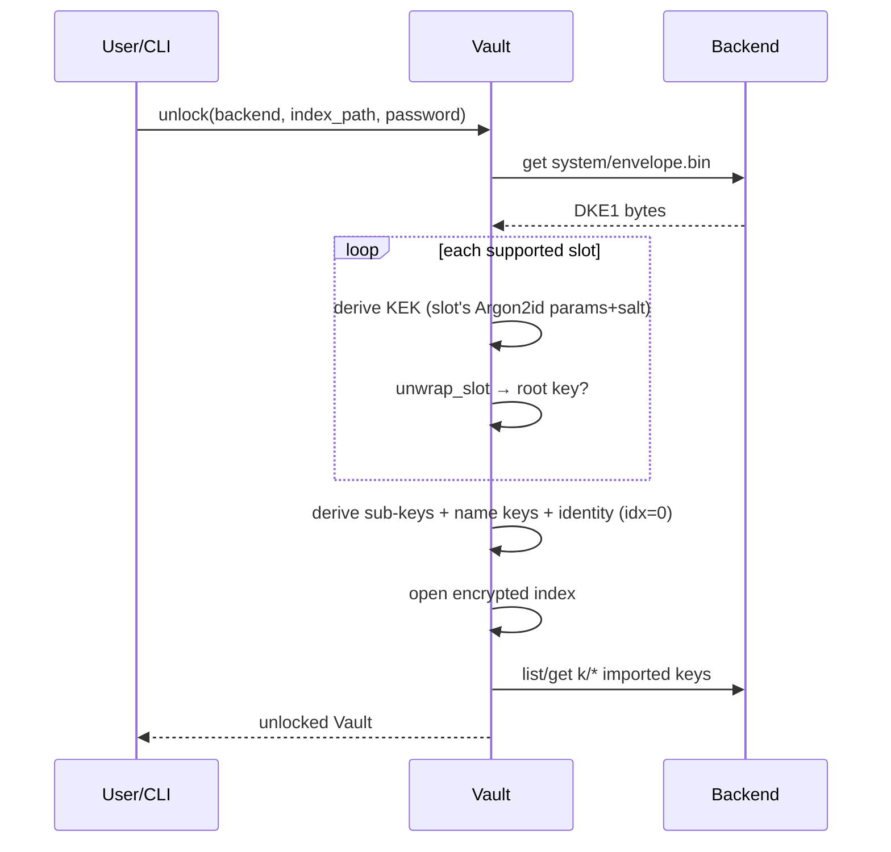
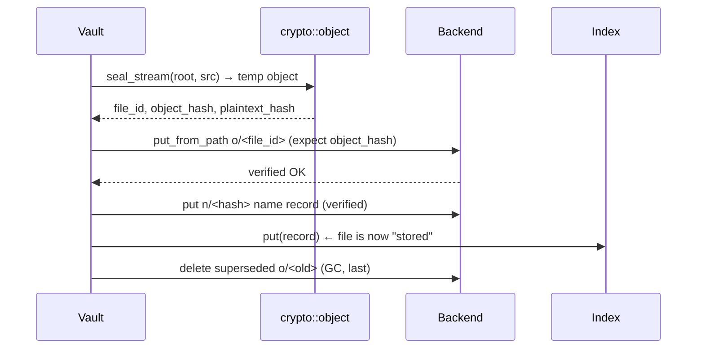
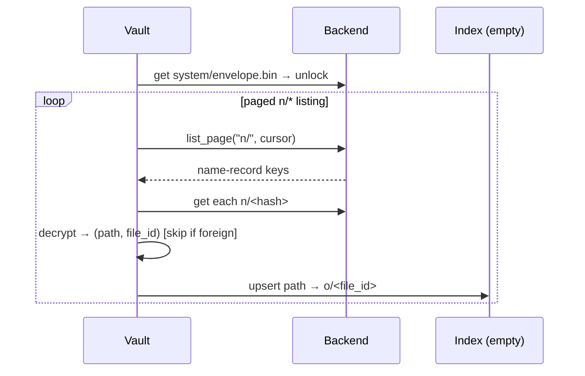
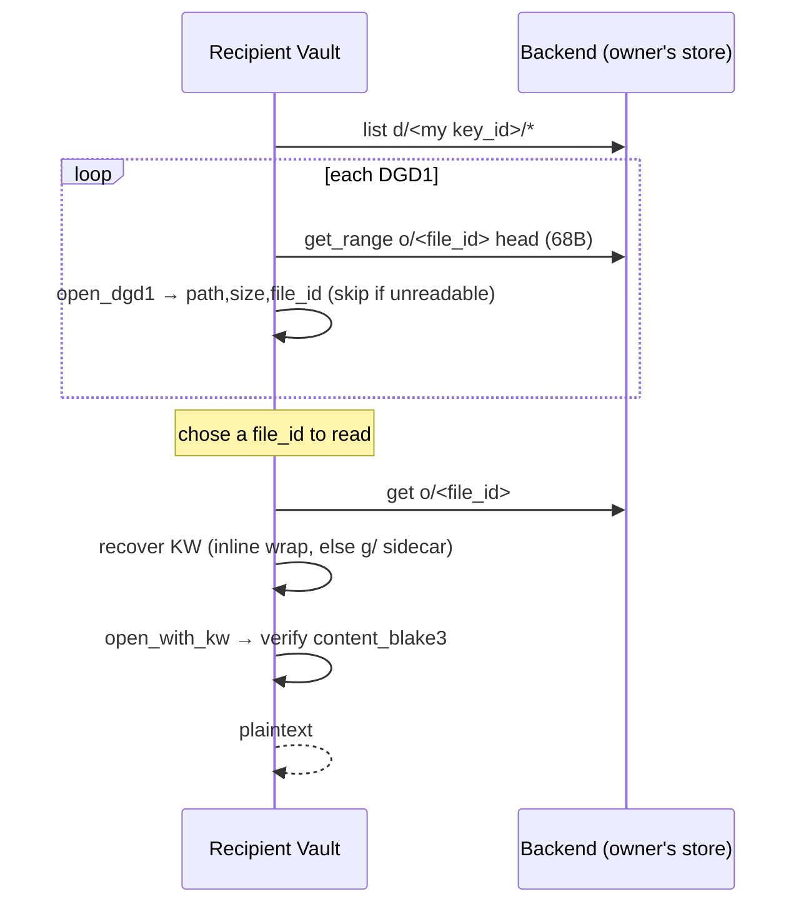

# DCTL architecture

How DCTL is put together: the crate graph and why it is split the way it is, the
layered runtime model, the frozen on-disk format stack, and step-by-step
data-flow walkthroughs for the operations that matter (init/unlock, put, get,
cross-device restore, share, and shared-object discovery).

This document describes **structure and flow**. For the *why-is-it-safe*
argument read [`SECURITY.md`](SECURITY.md); for the byte-exact, frozen on-disk
layout read [`FORMAT.md`](FORMAT.md). This file cross-links both wherever a claim
depends on them and never restates their normative detail.

> **Status.** Library crates are green and the CLI happy path
> (`init` / `copy` / `cat` / `verify` / restore) is smoke-tested against the
> local backend. The CLI is under active refactor and some surfaces are partial
> (e.g. `mount`). Live B2 / S3 / R2 has **not** been verified end-to-end — those
> integration tests exist but are `#[ignore]` + env-gated. See
> [`PROJECT_STATUS.md`](PROJECT_STATUS.md).

Related docs: [`README`](README.md) · [`CRATES`](CRATES.md) ·
[`GUIDE`](GUIDE.md) · [`SECURITY`](SECURITY.md) · [`FORMAT`](FORMAT.md) ·
[`GLOBAL_FLAGS`](GLOBAL_FLAGS.md) · [`ERROR_CODES`](ERROR_CODES.md) ·
[`EXIT_CODES`](EXIT_CODES.md) · [`commands/`](commands/README.md).

---

## 1. Crate graph

DCTL is a single Rust workspace (edition 2024) of eight crates. The dependency
edges below are the actual `path` dependencies declared in each crate's
`Cargo.toml`.

```mermaid
graph TD
    cli["dctl-cli<br/>(the 'dctl' binary)"]
    core["dctl-core<br/>(Vault: compose)"]
    crypto["dctl-crypto<br/>#![forbid(unsafe_code)]"]
    store["dctl-store<br/>(Backend trait)"]
    index["dctl-index<br/>(encrypted index)"]
    meta["dctl-meta<br/>(branding/paths)"]
    secmem["dctl-secmem<br/>(the ONLY unsafe)"]
    decode["dctl-decode<br/>(C99 ref + KAT)"]

    cli --> core
    cli --> store
    cli --> meta
    core --> crypto
    core --> store
    core --> index
    index --> crypto
    decode -.->|KAT cross-validation| crypto
    secmem -.->|intended key-holder backing<br/>(not yet wired in)| crypto

    classDef nowire stroke-dasharray: 4 3;
    class secmem nowire;
```

Solid edges are compiled dependencies. The `dctl-decode` edge exists only for
known-answer-test (KAT) cross-validation. The `dctl-secmem` edge is **dashed and
aspirational**: see the note in its subsection below.

### Per-crate responsibility

**`dctl-crypto`** — the clean-room crypto core and the sole owner of the frozen
v1 on-disk format. It is `#![forbid(unsafe_code)]` and `#![deny(unwrap/expect/
panic)]`: library code never panics on bad input, it returns a typed `Result`.
Modules bottom-to-top: `kdf` (Argon2id KEK derivation + adaptive calibration),
`envelope` (the `DKE1` slot list), `keys` (root key + HKDF-SHA512
domain-separated sub-keys + random DEKs), `aead` (context-bound
XChaCha20-Poly1305), `object` (the `DSF1` self-describing streaming object),
`kem` (§12 hybrid X25519 + ML-KEM-768 recipient layer), `names`/`path` (§5 path
records + NFC validation), and `constants` (every frozen identifier and every
tunable default, in one file). It is separated because the format is a
**20-year restorability contract**: keeping it in one unsafe-free, panic-free,
brand-neutral crate is what lets the C99 reference decoder and the KAT prove
that contract holds.

**`dctl-secmem`** — the one crate permitted to contain `unsafe`. It isolates
every platform FFI call — `mlock`/`munlock`, `VirtualLock`, `madvise`
(dump exclusion), and Apple crash-reporter hardening — behind a small audited
surface, and exposes `LockedSecret`: a heap buffer locked into RAM on
construction and unlocked + zeroized on drop. Its whole reason to exist is
**containment**: by owning all `unsafe`, it lets `dctl-crypto` (and everything
else) stay `#![forbid(unsafe_code)]`, so the security review of native memory
handling is confined to one place with a `// SAFETY:` note on every block.
Locking is best-effort — an unprivileged container or a low `RLIMIT_MEMLOCK`
may deny `mlock`, in which case the failure is logged, never fatal, and the
zeroize-on-drop protection still applies.

> **Accuracy note.** `dctl-secmem` is a workspace member, built and self-tested,
> but **no other crate currently depends on it** — the vault's root key is today
> held in a `zeroize::Zeroizing<[u8; 32]>`, not a `LockedSecret`. The crate is
> the designed home for `unsafe` and for page-locking long-lived key material;
> wiring it into `dctl-core`'s key holders is pending. The architectural
> invariant ("`dctl-crypto` is unsafe-free") is real and enforced today; the
> mlock protection of the live root key is not yet in effect.

**`dctl-meta`** — the single renameable source of product identity: binary name,
config/data/cache directory names, and the environment-variable prefix. It
exists so a rebrand touches exactly one crate. Crucially it does **not** define
any on-disk format identifier — those are frozen and brand-neutral in
`dctl-crypto::constants` — so renaming the product never touches stored data.

**`dctl-store`** — the provider-neutral `Backend` trait plus its backends
(`LocalFs`, `B2`, `S3`, `R2`). It moves **opaque** encrypted objects and knows
nothing about their contents; encryption lives one layer up. It is separated so
that "which cloud" is a runtime choice orthogonal to the crypto, and so the two
invariants the higher layers lean on — **verified writes** and **first-class
range reads** — are stated and enforced in exactly one place (see §5).

**`dctl-index`** — the local, encrypted, metadata-private index (SQLCipher via
`rusqlite` with the bundled SQLCipher, WAL, multi-process). Path keys are
keyed-hashed and record values are AEAD-encrypted with sub-keys derived from the
vault root, so the database file reveals neither paths nor metadata at rest. It
depends only on `dctl-crypto` for that keying. It is deliberately a **cache**:
it is rebuildable by rescanning the backend (§5.4), so losing it never means
losing data.

**`dctl-core`** — the `Vault`: the composition layer that wires crypto + store +
index into verified, metadata-private file operations. It holds the unlocked
root key, the derived name-layer keys, the vault's own recipient identity, and
the imported-identity set, and it owns the *ordering* guarantees (seal → verified
write → name record → durable index commit). It is where the format's rules
become operations.

**`dctl-cli`** — the `dctl` binary: argument parsing, remote/vault addressing,
config, the rclone-style verb surface (`ls`/`copy`/`sync`/`cat`/`verify`/
`index rebuild`/…), output formatting, and exit-code mapping. It depends on
`dctl-core` (vaults), `dctl-store` (plain remotes), and `dctl-meta` (identity).

**`dctl-decode`** — a dependency-free **C99** reference decoder for the
`kem_id=0` path plus a KAT harness that cross-validates it against the Rust
implementation on every build. A lone `.c` file that compiles with nothing but
`cc` is the artifact most likely to still build in 20 years — that is the point.

---

## 2. Layered model

At runtime the stack is a straight line: the CLI parses intent, `dctl-core`'s
`Vault` composes an operation, and the operation fans out to the three
lower engines — crypto, storage, index.



- **CLI → core.** The CLI resolves a `remote:` / `vault:` spec, obtains the
  password (interactive, `--password-command`, env), and calls a `Vault` method.
  It never touches ciphertext framing or keys directly.
- **core → crypto.** The `Vault` calls `object::seal*` / `object::open*`,
  `envelope`, `kdf`, `keys`, `kem`, and `names` for all cryptographic work. The
  crypto crate is pure: it takes bytes and keys, returns bytes or a typed error,
  and performs no I/O.
- **core → store.** All backend I/O goes through the `Backend` trait. The
  `Vault` hands the store already-sealed opaque bytes (or a path to them) and a
  content hash; the store's job is to land them durably and prove they landed.
- **core → index.** The index is written last on every mutation and consulted
  first on every read, but it is never authoritative — the backend is (§5.4, §6).

---

## 3. On-disk format stack at a glance

Everything DCTL writes to a backend is one of a small set of self-describing,
brand-neutral containers. Reading bottom-up, the wrapped **root key** unlocks
the vault; **objects** carry file content and embed their own data-encryption
key; **name records** map paths to objects; and the **§12 asymmetric family**
adds recipient sharing on top. All identifiers and sizes below are frozen in
`dctl-crypto::constants`; the normative layout is [`FORMAT.md`](FORMAT.md).

```
password ──Argon2id──▶ KEK ──unwraps──▶ ROOT KEY
                                          │  HKDF-SHA512 domain-separated sub-keys
             ┌────────────────────────────┼───────────────────────────────┐
             ▼                             ▼                               ▼
   DKE1 envelope slot            n/* name records                object-keying
   (system/envelope.bin)         (path → file_id map)                  │
                                                                        ▼
                                                            DSF1 object  o/<file_id>
                                                            68-byte head
                                                            + wrapped DEK (kem_id)
                                                            + enc metadata
                                                            + streaming AEAD chunks
                                                            + optional BLAKE3 footer
             §12 asymmetric family (kem_id=1), all bound to the object head:
             r/<key_id>  DRR1 public recipient registry (no secrets)
             g/<file_id> DGS1 grant sidecar (add/remove recipients, no re-upload)
             k/<key_id>  DIK1 imported-key store (root-sealed foreign keypair)
             d/<rid>/<file_id> DGD1 discovery pointer (enumerate, not read)
```

**The four layers, in words:**

1. **Envelope `DKE1`** (`FORMAT.md` §2) — a self-delimiting list of up to 64
   key-*slots*, each of which independently KEK-wraps the **same** root key.
   Today DCTL writes one password slot (Argon2id → XChaCha20-Poly1305 wrap, with
   a key-commitment). The slot list is the extension point for device / mnemonic
   / Shamir factors.
2. **Object `DSF1`** (`FORMAT.md` §3–§4) — a 68-byte fixed head (folded into
   every AAD), a wrapped DEK whose wrap mode is selected by `kem_id`
   (`0` = root-wrapped, `1` = hybrid recipient), AEAD-encrypted per-item
   metadata, then the plaintext split into `chunk_size` chunks each sealed with
   XChaCha20-Poly1305, and an optional BLAKE3 footer over the ciphertext. The
   object is **seekable** (range-readable chunk by chunk) and self-describing.
3. **Name records** (`FORMAT.md` §5) — `n/<keyed-hash>` → an AEAD record mapping
   an NFC-normalized logical path to a `file_id`. This is the **authoritative,
   backend-resident restore map**: it is what makes a vault rebuildable on a
   fresh device with only the password.
4. **§12 asymmetric family** (`FORMAT.md` §12–§14) — hybrid X25519 + ML-KEM-768
   recipient wrapping (`kem_id=1`), the public recipient registry, the grant
   sidecar for add/remove-without-re-upload, the imported-key store for
   multi-identity, and the discovery pointers that let a recipient enumerate
   what was shared to it.

### Backend key namespaces

Every byte a vault stores lives under one of these keys. The `<…>` components
are lowercase hex.

| Key pattern | Container | Purpose | FORMAT |
|---|---|---|---|
| `system/envelope.bin` | `DKE1` | The vault envelope: KEK-wrapped root key | §2 |
| `o/<file_id>` | `DSF1` | One encrypted file object (head + chunks) | §3 |
| `n/<keyed-hash>` | AEAD record | Authoritative path → `file_id` map | §5 |
| `r/<key_id>` | `DRR1` | Public recipient registry (public keys only, self-certifying) | §12.3 |
| `g/<file_id>` | `DGS1` | Grant sidecar: extra recipients for an object, rewritable | §12.6 |
| `k/<key_id>` | `DIK1` | Imported-key store: root-sealed foreign recipient keypair | §13 |
| `d/<recipient_key_id>/<file_id>` | `DGD1` | Per-(recipient,object) discovery pointer | §14 |

`file_id` is a random 16-byte id read from bytes `[52..68]` of the sealed object
head — path-independent and rename-stable, so renaming a file rewrites only its
`n/*` record, never the (possibly multi-GB) `o/*` payload.

#### One reserved name: `.dctl-staging.*`

Every verified write in the workspace stages its bytes beside the object under a
name beginning `.dctl-staging.` and `rename`s onto the final name once the stored
bytes have been checked. The rename is the commit, so a crash leaves a staging
file, and a staging file is a write that was never reported to anybody as stored.
**A key whose last component begins with that prefix is therefore not listed as
an object**, on any backend.

That is a namespace DCTL claims, and it matters on a **plain** remote, where the
backend key space is the user's own paths: a file literally named
`.dctl-staging.something` would not appear in a listing.

The claim is deliberately narrow and it replaced one that was not. The rule used
to be "any name containing `.tmp.`", applied as a substring test, which hid real
files — `report.tmp.2024.csv`, `db.tmp.2024-07-27.sql`, Office's own
`~$report.tmp.docx` — from every listing while `copy` reported `Files: 5 / 5,
Errors: 0`. One rule, one implementation, in `dctl_store::staging`.

---

## 4. Two invariants, stated precisely

These two properties are relied on by every write and every large read. They
are enforced in `dctl-store` (the `Backend` trait) and preserved by
`dctl-core`'s operation ordering.

### 4.1 Verified write

> A backend `put` **must not** report success unless the stored bytes match the
> caller-supplied `expected` content hash; on mismatch it must leave nothing
> committed.

`dctl-core` layers a stronger, end-to-end promise on top of that primitive:

> **Nothing is reported "stored" until its bytes are checksum-verified at the
> destination AND the index record is durably committed.**

Concretely, every put path — buffered (`put_file`), streaming
(`put_file_from_path`), and shared (`put_file_shared`) — writes in a fixed
order: (1) seal the object, (2) **verified write** the object to
`o/<file_id>`, (3) verified write the authoritative `n/*` name record,
(4) commit the index record — *and only step 4 makes the file "stored"*. Because
the index commit is last, a crash anywhere before it leaves a fully-formed,
readable object and name record on the backend but no index row; the next
`index rebuild` (or a lookup that falls back to the name record) picks it up.
Overwrites go one step further: the superseded object is GC-deleted **last**
(`gc_superseded_object`), after the replacement mapping is durable, so a failure
there can only leak storage — never lose the live object.

### 4.2 Constant-memory streaming

> Peak memory for a put or get of a file is `O(chunk_size)`, independent of file
> size.

`put_file_from_path` seals the source straight from disk into a temp object with
`object::seal_stream` (itself `O(chunk_size)`), then hands that temp file to the
backend's `put_from_path`. Three passes over file data — seal, hash the sealed
object for the verified-write `expected`, hash the source plaintext for index
parity — are each a fixed working buffer. The heavy CPU + blocking file I/O runs
off the async runtime via `spawn_blocking`. `get_file_to_path` mirrors this:
stream the object to a temp file, then `object::open_reader` decrypts and
verifies one chunk at a time into a temp sibling of the destination, folding a
streaming BLAKE3 over the emitted plaintext.

> **Where the bound holds.** `LocalFs`, S3, R2, and B2 **all stream** the transfer
> stage at `O(part_size)` — S3/R2 via multipart-from-file through the S3 client and
> B2 via its large-file API — so the trait's in-memory buffering *default* for
> `put_from_path`/`get_to_path` is **not used** by any shipped cloud backend. The
> **decrypt / verify / write** stage is likewise always `O(chunk_size)` regardless
> of backend. The one honest caveat is that these cloud paths are **not yet
> live-verified end-to-end** — their integration tests are `#[ignore]` + env-gated
> (see [`PROJECT_STATUS.md`](PROJECT_STATUS.md)). `put_file` and `get_file` (the
> buffered `Vec` variants) deliberately hold the whole plaintext and are for small
> objects; large media should use the `*_to_path` / `rcat` paths.

---

## 5. Data-flow walkthroughs

The `Vault` type (`dctl-core`) is the actor in every flow below. Backend key
names use the §3 namespaces. Real CLI equivalents match the actual verb surface
(see [`commands/`](commands/README.md)) and [`GLOBAL_FLAGS.md`](GLOBAL_FLAGS.md).

### 5.1 Init / unlock a vault

**Init** (`Vault::init`, CLI `dctl init --name NAME --base BASE`):

1. Generate a random 16-byte salt and derive a KEK from the password with
   Argon2id (`kdf::derive_kek`).
2. Generate a random 32-byte root key and a random 16-byte `vault_id`.
3. Wrap the root key into a single **password slot** (`envelope::wrap_slot`):
   XChaCha20-Poly1305 wrap under the KEK, with a key-commitment and the stored
   Argon2id parameters + salt.
4. Serialize the `DKE1` envelope and **verified-write** it to
   `system/envelope.bin`.
5. Derive sub-keys and open the local encrypted index (`assemble`): `index-key`,
   the name-layer keys, and the vault's own root-derived recipient identity
   (§12.4, `idx = 0`).

**Unlock** (`Vault::unlock`, implied by any vault operation with a password):

1. Read and parse `system/envelope.bin`. Any failure surfaces as a single
   opaque `Unlock` error (no oracle about which step failed).
2. For each slot, apply the `FORMAT.md` §8 **skip rules**: attempt only a slot whose
   `slot_type` / `flags` / `wrap_algo` / `kdf_id` this reader fully supports; an
   unsupported slot is skipped, never a reason to reject the envelope.
3. Re-derive the KEK from that slot's **own stored** Argon2id params + salt
   (out-of-range params fail validation → skip the slot), then try
   `envelope::unwrap_slot`. The first slot that unwraps wins.
4. `assemble` as in init, then load the §13 imported-key store (`k/*`) into the
   identity set. An unreadable/unknown `k/*` entry is skipped, never fatal.



### 5.2 Put a file (chunked streaming seal → verified write → index)

`Vault::put_file_from_path` (constant-memory; CLI `dctl copy SRC vault:PATH`):

1. NFC-normalize the logical path (`path::normalize`).
2. Look up any object the path currently maps to, to GC after the overwrite is
   durable.
3. On a blocking task, **seal the source straight to a temp object** with
   `object::seal_stream`: 68-byte head + root-wrapped DEK (`kem_id=0`) +
   encrypted metadata + `chunk_size` AEAD chunks + BLAKE3 footer. Compute
   `file_id` from head `[52..68]`, the object's BLAKE3 (the verified-write
   `expected`), and the source plaintext BLAKE3 (index parity). All
   `O(chunk_size)`.
4. **Verified streaming write** of the temp object to `o/<file_id>`
   (`put_from_path`): the backend confirms the on-disk bytes hash to the
   expected value.
5. **Verified write** of the authoritative `n/*` name record
   (`seal_record` → path → `file_id`).
6. **Commit the index record** — *this* is what makes the file "stored". Its
   `modified_unix` is the `Modified` the **caller** supplied, never the clock:
   see below.
7. GC the superseded object (delete-last), if the path previously mapped to a
   different `file_id`.



`Vault::put_file` is the buffered equivalent for small data: same order, same
guarantees, whole plaintext in RAM.

**Every put takes a `Modified`, and it is required.** The index record's
`modified_unix` describes the *content*, not the write — `Modified::At(seconds)`
for a copy of something that already had an age, `Modified::Now` for content that
originates in the call (a pipe, an object created empty), `Modified::Unknown` when
a source exists but its time could not be read, which is recorded as absence
rather than as a fabricated `now`.

It is an enum and a required argument rather than an `Option` because the three
are genuinely different claims and the wrong one is expensive. Every put path used
to stamp `now_unix()` on its own authority, which is true about the write and says
nothing about the file it was made from; a vault destination could therefore never
match its source by modification time, so `dctl copy` found the entire dataset
"modified" on every run and re-uploaded it, and `dctl check` called a tree it had
just written entirely different. Naming the case at each call site is what makes
that impossible to reintroduce by omission.

### 5.3 Get a file

`Vault::get_file` / `get_file_to_path` (CLI `dctl cat` / `dctl copy vault:PATH DEST`):

1. NFC-normalize the path and **resolve it to an object key** via
   `lookup_object_key`: try the local index first, then fall back to the
   authoritative `n/*` name record on the backend. So a read works on any device
   with only the password — no prior local index required.
2. Parse the 68-byte head; `head.kem_id` selects the decode path:
   - `kem_id=0` → unwrap the DEK under the vault root (`object::open*`).
   - `kem_id=1` → recover the object key `KW` via the vault's recipient identity
     (§5.6), then decode.
3. Decrypt chunk by chunk, verifying every chunk's Poly1305 tag and the footer.
4. Verify the recovered plaintext against the object's **own**
   DEK-authenticated `content_blake3` in its metadata — integrity that holds
   even with no local cache. `get_file_to_path` folds this as a streaming BLAKE3
   and writes atomically (temp sibling → fsync → rename); any mismatch leaves no
   destination file.

### 5.4 Cross-device restore (index rebuild from backend)

The index is a cache; the backend is authoritative. A wiped or brand-new device
recovers the whole vault with only the password.

`Vault::rebuild_index` (CLI `dctl index rebuild vault:`):

1. `unlock` the vault (reads `system/envelope.bin`, recovers the root key).
2. Page through every `n/*` name record on the backend (`list_page`, constant
   memory).
3. Decrypt each record with the name-layer keys → `(path, file_id)`. A record
   that does not decrypt (e.g. it belongs to another vault under a shared
   bucket) is **skipped with a warning**, never aborting the rebuild.
4. Upsert an index row for `path → o/<file_id>`. Sizes are left unset (a rebuild
   stays a cheap, list-only pass) and populate on first read.

After rebuild every path is listable and readable, and content integrity is
re-checked on read against each object's own `content_blake3`. This flow is the
basis of the proven cross-device restore: a fresh index + `index rebuild` +
password → byte-exact restore.



### 5.5 Share to a recipient (hybrid wrap + DGS1 sidecar + DGD1 discovery)

Two ways to share, both producing `kem_id=1` objects. Sharing assumes a
**shared backend** (the recipient reads the owner's store). Recipient public
keys are `DRK1` hybrid identities discovered from the `r/*` registry
(`fetch_recipient`) or handed over out-of-band.

**At upload time** — `Vault::put_file_shared` (seal to an explicit recipient
set):

1. Build the recipient set: the **owner's own identity is always prepended**
   (§12.8 owner-inclusion MUST — a `kem_id=1` object has no symmetric fallback,
   so without this a write-only backup would be unrecoverable), then each
   distinct recipient, deduplicated by `key_id`.
2. `object::seal_to_recipients`: generate a random object key `KW` and DEK, seal
   the DSF1 body under it, and wrap `KW` to each recipient with the hybrid
   combiner — per recipient a fresh X25519 ephemeral + ML-KEM-768 Encaps,
   HKDF-combined, bound to the exact 68-byte head (anti-transplant).
3. Verified-write the object to `o/<file_id>`, then the `n/*` name record, then
   commit the index — the **same durability ordering as `put_file`**.
4. Write one `DGD1` discovery pointer per *explicit* (non-owner) recipient at
   `d/<recipient_key_id>/<file_id>` so each can enumerate the object; the owner
   is skipped (it discovers via its own `n/*`).
5. GC any superseded object last.

**After upload, without re-uploading** — `Vault::share_add_recipients` (CLI
sharing verbs) writes/extends a `DGS1` grant sidecar at `g/<file_id>`:

1. Resolve the path → object; range-read the head + inline `kem_wrap` block
   (never the whole payload).
2. Recover the object's `KW` using any held identity (the calling vault must
   already be a reader).
3. Re-wrap that same `KW` to each new recipient as a §12.2 sub-record (fresh
   ephemeral + Encaps, bound to the head), append to the sidecar's grants, bump
   the monotonic `grant_gen`, and **verified-write** the sidecar. A transient
   backend error aborts rather than risking a `grant_gen` rollback that would
   silently revoke earlier grants.
4. Write a `DGD1` for each newly added recipient. `share_remove_recipient`
   deletes the recipient's sidecar grant and its `DGD1`.

> Guidance (§12.6): put **durable** recipients (owner, permanent backup key)
> inline at upload — they cannot be removed without re-uploading — and put
> **revocable** recipients in the sidecar.

### 5.6 Discover + read a shared object

A recipient cannot read the owner's `n/*` name records (they are keyed to name
keys the recipient lacks), so discovery is a separate, read-granting-nothing
channel.

`Vault::discover_shared` → `get_shared`:

1. For each identity the recipient vault holds (root-derived first, then every
   imported `k/*` identity), page-list `d/<key_id>/*`.
2. For each `DGD1`: fetch the object's 68-byte head (one range request), find
   the matching held identity, and `open_dgd1` — recover the per-record
   discovery key `DW`, then decrypt the pointer plaintext (path, size,
   content hash, `file_id`). A record that does not open (unknown
   version/suite/schema, tamper, stale/renamed object, or not addressed to a
   held identity) is **skipped**, never failing the enumeration. Discovery grants
   **no read access**: `DW` never wraps the object's `KW`/`DEK`.
3. To read, call `get_shared(file_id)`: fetch `o/<file_id>`, confirm
   `kem_id=1`, **recover `KW`** via the identity set — inline `kem_wrap`
   sub-record first, then a `g/*` sidecar grant, first success wins — decode with
   `open_with_kw`, and verify the plaintext against the object's own
   `content_blake3`. `get_shared_to_path` does this at constant memory; only
   `KW` (a per-object secret) ever crosses into the blocking decode task, never a
   recipient private key.



---

## 6. Cross-cutting design choices

- **The format is brand-neutral and frozen.** All magic bytes, labels, and sizes
  live in `dctl-crypto::constants` with compile-time length assertions; renaming
  the product (via `dctl-meta`) never touches stored data. See
  [`FORMAT.md`](FORMAT.md) §12.10.
- **The backend is authoritative; the index is a cache.** Every read can fall
  back to the backend's `n/*` records, and the whole index is rebuildable
  (§5.4). Losing the local database never loses data.
- **Unknown-handling is a one-way door.** Unsupported slots, imported keys, and
  discovery records are skipped, not fatal (`FORMAT.md` §8) — so a future format
  extension can coexist with an older reader without bricking a vault.
- **Objects are self-describing and self-authenticating.** An object embeds its
  own wrapped key and its own `content_blake3`, so integrity and decodability do
  not depend on any external index or side file — the property the C99 reference
  decoder exercises.

For the threat model, the metadata/side-channel caveats (sharing-graph edges in
`g/*` and `d/` path components, object size equalling the cleartext plaintext
length, no forward secrecy against key compromise, no sender authentication in
v1), and the full cryptographic rationale, read [`SECURITY.md`](SECURITY.md).
For byte-exact framing, read [`FORMAT.md`](FORMAT.md).
