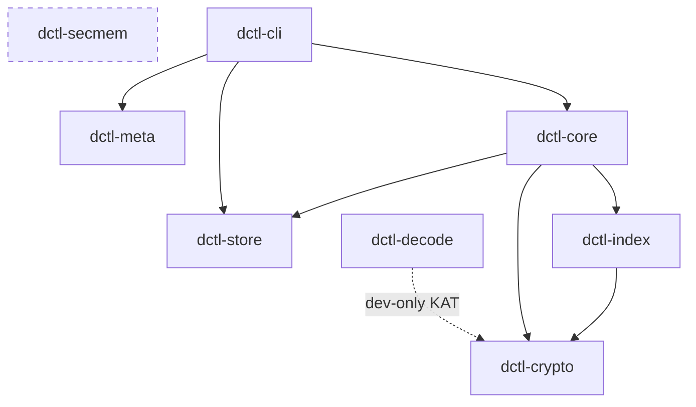

# DCTL crate reference

DCTL is a Cargo **workspace** (`edition = "2024"`, `rust-version = 1.85`, `resolver = "3"`)
built from eight crates. Each crate owns one concern and exposes a small, deliberate public
surface; the CLI binary composes them. This document is a per-crate map: purpose, the real
public types/functions, the internal module layout, dependencies, and the invariants each crate
is responsible for.

> This is a hand-written orientation guide. For the **complete, always-current API** run
> `cargo doc --workspace --no-deps --open` — every symbol named below is documented there with
> its full signature.

Related reading: [Architecture](./ARCHITECTURE.md) · [Security model](./SECURITY.md) ·
[On-disk format](./FORMAT.md) · [Developer guide](./DEVELOPMENT.md) ·
[Docs index](./README.md).

---

## Dependency order

Crates are listed leaf-first: each depends only on crates above it. This is a valid build /
reading order. "Internal deps" lists only *other DCTL crates*; the standalone crypto/store
primitives are noted per crate below.

| # | Crate | Internal deps | Role | `unsafe` policy |
|---|-------|---------------|------|-----------------|
| 1 | [`dctl-secmem`](#dctl-secmem) | — | Lock key pages out of swap / crash dumps | **The one crate that MAY use `unsafe`** |
| 2 | [`dctl-meta`](#dctl-meta) | — | Renameable app identity + platform paths | `#![forbid(unsafe_code)]` |
| 3 | [`dctl-crypto`](#dctl-crypto) | — | Clean-room crypto + the frozen v1 format | `#![forbid(unsafe_code)]` |
| 4 | [`dctl-store`](#dctl-store) | — | Provider-neutral `Backend` + backends | `#![forbid(unsafe_code)]` |
| 5 | [`dctl-index`](#dctl-index) | `dctl-crypto` | Encrypted, metadata-private local index | `#![forbid(unsafe_code)]` |
| 6 | [`dctl-core`](#dctl-core) | `dctl-crypto`, `dctl-store`, `dctl-index` | The `Vault` — composes everything | `#![forbid(unsafe_code)]` |
| 7 | [`dctl-cli`](#dctl-cli) | `dctl-core`, `dctl-store`, `dctl-meta` | The `dctl` binary | *(no crate-level attr)* |
| 8 | [`dctl-decode`](#dctl-decode) | `dctl-crypto` *(dev-only)* | C99 reference decoder + KAT harness | `#![forbid(unsafe_code)]` |



> **Note (accuracy):** `dctl-secmem` is present in the workspace and fully implemented, but
> **no other crate currently declares it as a dependency** — a grep of every `Cargo.toml` and
> `src/` outside the crate itself finds no consumer. It is drawn dashed above to reflect that it
> is not yet wired into the crypto/core hot paths. The `zeroize`-on-drop protection that the
> other crates *do* use comes directly from the `zeroize` crate, not from `dctl-secmem`.

All crate versions are `0.0.1`. Shared dependency versions are pinned once in the workspace
`[workspace.dependencies]` table; a few crates pin their own domain-specific primitives locally
(noted below), which is deliberate — see each crate's `Cargo.toml`.

---

## dctl-secmem

> `crates/dctl-secmem/src/lib.rs` —
> *"DCTL secure memory: lock key pages out of swap and crash dumps (the one audited home for
> unsafe FFI)."*

**Purpose.** Pin sensitive pages in RAM (`mlock`/`VirtualLock`), exclude them from core dumps
where the platform allows (`madvise`), and provide a heap buffer that is locked on construction
and unlocked + zeroized on drop. `zeroize` wipes live RAM copies, but cannot recover bytes the OS
has already paged to swap or captured in a dump; this crate closes that gap.

**Key public API** (`pub use` from `lib.rs`):

| Symbol | Kind | Notes |
|--------|------|-------|
| `LockedSecret` | struct | Locked-on-construct, zeroize-on-drop heap buffer. Methods: `zeroed`, `from_slice`, `is_locked`, `len`, `is_empty`, `as_slice`, `as_mut_slice` |
| `lock_memory(ptr, len) -> bool` | fn | Best-effort page lock; returns whether it succeeded |
| `unlock_memory(ptr, len)` | fn | Release a lock |
| `rlimit_memlock_budget() -> Option<u64>` | fn | Query the process `RLIMIT_MEMLOCK` budget |
| `opportunistic_chunk_lock_enabled() -> bool` | fn | Whether opportunistic per-chunk locking is on |
| `apple_harden_crash_reporter()` | fn | Apple-platform crash-reporter / `PT_DENY_ATTACH`-style hardening |

**Modules:** `secret` (`LockedSecret`), `lock` (the FFI lock/unlock), `budget` (memlock rlimit
accounting), `harden` (Apple crash-reporter hardening).

**Dependencies:** `zeroize`, `tracing`; `libc` on `cfg(unix)`. No DCTL crates.

**Invariants it owns.**
- **The single audited home for `unsafe`.** By isolating every platform FFI call here,
  `dctl-crypto` and the rest of the workspace stay `#![forbid(unsafe_code)]`. Every `unsafe`
  block carries a `// SAFETY:` note; the crate sets
  `#![deny(clippy::undocumented_unsafe_blocks)]`.
- **Best-effort, never fatal.** Locking may be denied (unprivileged containers, low
  `RLIMIT_MEMLOCK`); failures are logged, not errors, and the zeroize-on-drop guarantee always
  holds.
- `#![deny(clippy::unwrap_used, expect_used, panic)]`.

---

## dctl-meta

> `crates/dctl-meta/src/lib.rs` —
> *"DCTL identity — single, renameable source for the app name, paths, and env prefix."*

**Purpose.** One place to rebrand the product. The binary name, config/data/cache directories,
and environment-variable prefix all derive from here. **On-disk format identifiers are
deliberately NOT here** — those are frozen and brand-neutral in `dctl-crypto::constants`, so a
rebrand never touches stored data.

**Key public API:**

| Symbol | Kind | Value / role |
|--------|------|--------------|
| `APP_NAME` | `const &str` | `"DCTL"` |
| `BINARY_NAME` | `const &str` | `"dctl"` (mirrored by `dctl-cli`'s `[[bin]]`) |
| `env_prefix() -> String` | fn | Derived env-var prefix |
| `env_var(setting: &str) -> String` | fn | Full env var name for a setting |
| `paths::config_dir/data_dir/cache_dir/config_file() -> PathBuf` | fn | Platform dirs (via `directories`) |
| `paths::CONFIG_FILE_NAME` | `const &str` | `"config.toml"` |

**Modules:** `identity` (names + env), `paths` (platform directories).

**Dependencies:** `directories`. No DCTL crates.

**Invariants it owns.** Product identity lives *only* here; format identity lives *only* in
`dctl-crypto`. `#![forbid(unsafe_code)]`, `#![deny(clippy::unwrap_used, expect_used, panic)]`.

---

## dctl-crypto

> `crates/dctl-crypto/src/lib.rs` —
> *"DCTL clean-room, streaming-first, post-quantum-ready encryption core."*

**Purpose.** The clean-room implementation of the **frozen v1 on-disk format** and all its
cryptography: Argon2id KDF, XChaCha20-Poly1305 AEAD, HKDF-SHA512 key derivation, BLAKE3, the
`DKE1` envelope, the `DSF1` streaming object, §5 name records, and the §12 hybrid
X25519 + ML-KEM-768 recipient layer. The normative layout it implements is
[`docs/FORMAT.md`](./FORMAT.md).

**Key public modules and their real symbols:**

| Module | Purpose | Notable public symbols |
|--------|---------|------------------------|
| `constants` | Frozen, brand-neutral format IDs | `ENVELOPE_MAGIC = b"DKE1"`, `OBJECT_MAGIC = b"DSF1"`, `ALGO_XCHACHA20_POLY1305`, `KEM_ID_NONE`/`KEM_ID_HYBRID`, `OBJECT_HEAD_LEN = 68`, `SLOT_TYPE_{DEVICE,PASSWORD,MNEMONIC,SHAMIR}`, `INFO_{INDEX,CACHE,AUDIT,NAME_HASH,…}` domain-separation labels |
| `kdf` | Argon2id KEK derivation + calibration | `derive_kek`, `derive_kek_with_params`, `calibrate` → `CalibratedParams`, `validate_params`, `normalize_passphrase`, `generate_salt`, `generate_mnemonic`, `derive_kek_from_mnemonic` |
| `envelope` | `DKE1` slot-list envelope | `Envelope`, `Slot`, `parse`, `serialize`, `wrap_slot`, `unwrap_slot`, `generate_vault_id`, `WRAPPED_ROOT_LEN` |
| `keys` | Root key + HKDF sub-keys | `generate_key`, `derive_subkey`, `derive_subkey_from_ikm` |
| `aead` | Context-bound XChaCha20-Poly1305 | `encrypt`, `decrypt`, `encrypt_with_nonce`, `decrypt_with_nonce`, `NONCE_LEN`, `TAG_LEN` |
| `object` | `DSF1` self-describing chunked object | `seal`, `open` → `Opened`, `Head`/`parse_head`, `Metadata`/`build_metadata`/`parse_metadata`, `seal_stream`/`open_stream`/`open_reader`, `seal_to_recipients`/`open_as_recipient`/`open_with_kw` |
| `kem` | §12 hybrid recipient layer (`kem_id=1`) | `RecipientKeypair`, `Drk1Public`, `MlKemEncapKey`/`MlKemDecapKey`, `derive_recipient`, `seal_dgd1`/`open_dgd1` + `DiscoveryInfo`, `generate_external`, `parse_dik1`/`serialize_dik1`, re-exports `x25519_dalek::StaticSecret` |
| `names` | §5 `n/*` path→object records | `NameKeys` (`derive`, `record_key`, `seal_record`, `open_record`), `NameRecord` |
| `path` | §5 NFC normalization + validation | `normalize`, `validate`, `UCD_ASSIGNED_VERSION` (compile-pinned to Unicode 15.1.0) |
| `rng` | CSPRNG wrapper | thin `getrandom` wrapper — see below |
| `error` | Crate error type | `CryptoError`, `Result` |

**Dependencies:** self-pinned crypto primitives — `argon2`, `chacha20poly1305`, `hkdf`,
`getrandom`, `ml-kem` (features `deterministic`, `zeroize`), `x25519-dalek`; plus workspace
`blake3`, `sha2`, `subtle`, `unicode-normalization`, `unicode-properties` (`=0.1.2`, pinning UCD
15.1.0), `bip39`, `zeroize`, `hex`, `thiserror`. **No DCTL crates** — it is a pure leaf.

**Invariants it owns.**
- **`#![forbid(unsafe_code)]`** — no `unsafe` anywhere in the crypto core.
- **Frozen v1 format.** Every format identifier is a `const` in `constants` and is independent of
  the product name (so a rebrand via `dctl-meta` never disturbs stored bytes).
- **Never panics on bad input** — `#![deny(clippy::unwrap_used, expect_used, panic)]`. The *one*
  audited exception is in `rng`: `getrandom::fill(buf).expect("OS CSPRNG unavailable")`, marked
  `#[allow(clippy::expect_used)]` because a missing OS CSPRNG is unrecoverable.
- Key-committing AEAD, domain-separated sub-keys, and PQ-hybrid recipient wrapping as specified
  in FORMAT.md.

---

## dctl-store

> `crates/dctl-store/src/lib.rs` —
> *"DCTL storage layer — a provider-neutral `Backend` abstraction plus backends."*

**Purpose.** Move opaque, already-encrypted objects to/from a storage provider with two
properties the layers above depend on: **first-class random-access (Range) reads** for streaming
huge media, and **verified writes** that never report success unless the stored bytes match the
expected content hash. This layer is content-agnostic — encryption lives one layer up.

**Key public API:**

| Symbol | Kind | Role |
|--------|------|------|
| `Backend` | `#[async_trait]` trait (`Send + Sync`) | The provider abstraction (below) |
| `UploadTicket` | struct | Presigned delegated-upload ticket from `prepare_upload` |
| `LocalFs` | struct | Local-filesystem backend (fully exercised) |
| `S3Backend`, `S3Config` | struct | S3 backend + config |
| `R2Backend` | struct | Cloudflare R2 backend |
| `ContentHash`, `HashAlgo`, `Hasher` | enum/struct | `compute`, `blake3`, `sha1`, `sha256`, `hex`, `matches` |
| `ObjectKey`, `ByteRange`, `ObjectMeta`, `Page`, `PutOutcome` | struct | Data model |
| `StoreError`, `Result` | error | Crate error type |

**The `Backend` trait** (`backend.rs`):

```rust
fn name(&self) -> &'static str;
async fn put(&self, key: &ObjectKey, data: Bytes, expected: &ContentHash) -> Result<PutOutcome>;
async fn put_from_path(/* streaming, constant-memory multipart */) -> Result<PutOutcome>;
async fn get(&self, key: &ObjectKey) -> Result<Bytes>;
async fn get_to_path(&self, key: &ObjectKey, dest: &Path) -> Result<()>;   // default impl
async fn get_range(&self, key: &ObjectKey, range: ByteRange) -> Result<Bytes>;
async fn head(&self, key: &ObjectKey) -> Result<ObjectMeta>;
async fn exists(&self, key: &ObjectKey) -> Result<bool>;
async fn delete(&self, key: &ObjectKey) -> Result<()>;
async fn list_page(&self, prefix: &str, cursor: Option<String>) -> Result<Page>;
async fn prepare_upload(/* presign → UploadTicket */) -> …;
```

**Modules:** `backend` (trait + `UploadTicket`), `model` (data types), `checksum`
(`ContentHash`/`Hasher`), `local` (`key_path`, `verified_write`, `read`, `remove`, `walk`),
`s3` (`client`, `config`, `sigv4`, `xml`), `b2` (`api`, `config`, `download`, `listing`,
`upload`, `name`, `constants`), `r2` (thin S3-compatible wrapper), `streaming` (internal
constant-memory multipart), `tls` (internal rustls setup), `error`.

**Dependencies:** `reqwest` (rustls-TLS), `rustls`, `rustls-post-quantum`, `webpki-roots`,
`tokio`, `async-trait`, `bytes`, `quick-xml`, `hmac`, `sha1`, `sha2`, `blake3`, `serde`,
`serde_json`, `hex`, `thiserror`, `tracing`. **No DCTL crates.**

**Invariants it owns.**
- **Verified writes** — a `put` returns `PutOutcome { verified: ContentHash, … }` only after the
  stored bytes are confirmed to match the expected hash.
- **Constant-memory streaming** — `put_from_path` / multipart upload keep memory bounded for
  arbitrarily large objects (adaptive part sizing, `MAX_PARTS` cap).
- **Random-access reads** via `get_range`, first-class for media streaming.
- **Delegated upload** via `prepare_upload` → `UploadTicket` (presign).
- `#![forbid(unsafe_code)]`, `#![deny(clippy::unwrap_used, expect_used, panic)]` (relaxed in
  `#[cfg(test)]` only).

> **Accuracy caveat:** the S3 / B2 / R2 backends are implemented, but their **live end-to-end
> integration tests are `#[ignore]` + env-gated** and have not been verified against real
> credentials this cycle. The `LocalFs` backend is fully exercised. See
> [PROJECT_STATUS.md](./PROJECT_STATUS.md).

---

## dctl-index

> `crates/dctl-index/src/lib.rs` —
> *"DCTL encrypted, metadata-private index."*

**Purpose.** A fast local cache mapping logical file paths to each object's location, wrapped
key, and integrity data. **Path keys are keyed-hashed and record values are AEAD-encrypted**, so
the on-disk database reveals neither paths nor metadata at rest. The index is *rebuildable* by
rescanning object/name records, so losing it never means losing data.

**Key public API:**

| Symbol | Kind | Role |
|--------|------|------|
| `Index` | struct | The store handle |
| `Index::open(path, index_subkey: &[u8;32]) -> Result<Self>` | fn | Open/create keyed with the derived index sub-key |
| `Index::{put, get, contains, delete, count, all, for_each}` | fn | Record CRUD + iteration |
| `Record` | struct | `path`, `object_key`, `size`, `modified_unix: Option<i64>`, `content_hash: Vec<u8>` (+ more) |
| `IndexError`, `Result` | error | Crate error type |

**Modules:** `index` (`Index`), `record` (`Record`), `keying` (internal — the
`BLAKE3_keyed(HKDF(subkey,"index-keying-v1"), path)` storage-key derivation), `error`.

**Dependencies:** `dctl-crypto` (for the keying primitives), `rusqlite` (feature
`bundled-sqlcipher-vendored-openssl` — compiles **SQLCipher** + vendors OpenSSL, so no system
libs are needed), `blake3`, `postcard`, `serde`, `zeroize`, `hex`, `thiserror`.

**Invariants it owns.**
- **Metadata-private at rest** — whole-DB encryption via SQLCipher (raw key), *plus* per-row
  keyed-hash lookup keys and AEAD-encrypted values, so neither paths nor sizes leak from the DB
  file.
- **Multi-process safe** — WAL mode; the app and (planned) File-Provider extension can share one
  DB (FORMAT.md §9, multi-process index, rule 5).
- **Rebuildable** — it is a cache, never the source of truth (that is the backend-resident `n/*`
  records).
- `#![forbid(unsafe_code)]`, `#![deny(clippy::unwrap_used, expect_used, panic)]`.

---

## dctl-core

> `crates/dctl-core/src/lib.rs` —
> *"DCTL core — the vault that composes crypto + storage + index into verified,
> metadata-private file operations."*

**Purpose.** The `Vault` binds a never-changing root key (unwrapped from a password-protected
envelope) to a `Backend` and a local encrypted `Index`, and exposes the actual file operations.
Every write encrypts to a self-describing object, does a *verified write* to the backend, then
commits the index — **success is reported only after the durable index commit.**

**Key public API** (`Vault`, from `crates/dctl-core/src/vault/`):

| Method | Role |
|--------|------|
| `Vault::init(…)` / `Vault::unlock(…)` | Create / open a vault |
| `put_file(path, data, modified)` / `put_file_from_path(logical, source, modified)` | Buffered / streaming (constant-memory) put. `modified` is a required `Modified` — the source's own time, `Now`, or `Unknown` — so no write path can stamp the clock by omission |
| `get_file(path) -> Zeroizing<Vec<u8>>` / `get_file_to_path(logical, dest)` | Buffered / streaming get |
| `list(prefix) -> Vec<Record>` | List by prefix |
| `record(path) -> Option<Record>` | Keyed lookup of one path (no prefix scan) |
| `delete_file(path) -> bool` | Delete |
| `verify_file(path)` | Integrity check |
| `rebuild_index() -> u64` | **Cross-device restore** — rescan backend, rebuild index from password alone |
| `put_file_shared(…, modified)` | §12 asymmetric put to recipients |
| `share_add_recipients(…)` / `share_remove_recipient(…)` | §12.6 grant sidecar (no re-upload) |
| `discover_shared() -> Vec<SharedObject>` / `get_shared(file_id)` / `get_shared_to_path(…)` | §14 DGD1 discovery + fetch |
| `publish_identity()` / `fetch_recipient(key_id) -> kem::Drk1Public` | §12.3 recipient registry |
| `import_keypair()` / `import_keypair_material(…)` | §13 DIK1 imported keys |
| `identity()` / `identity_key_id()` / `identity_key_ids()` | This vault's recipient identity |

Also re-exported at crate root: `pub use dctl_crypto::kem;` (recipient public-key types),
`pub use dctl_index::Record;`, `Modified`, and `CoreError` / `Result`.

**Modules:** `vault` (submodules: `mod`, `layout`, `put`, `put_stream`, `get`, `list`,
`restore`, `share`, `imported`), `error`.

**Dependencies:** `dctl-crypto`, `dctl-store`, `dctl-index`; plus `tokio`, `bytes`, `blake3`,
`hex`, `zeroize`, `tempfile`, `thiserror`, `tracing`.

**Invariants it owns.**
- **Verified-write + durable-commit ordering** — nothing is reported stored until its bytes are
  checksum-verified at the destination *and* committed to the index.
- **Cross-device restore** — `rebuild_index` reconstructs the whole index from the backend using
  only the password (proven by CLI smoke test).
- Plaintext returned to callers is wrapped in `Zeroizing`.
- `#![forbid(unsafe_code)]`, `#![deny(clippy::unwrap_used, expect_used, panic)]` (relaxed in
  `#[cfg(test)]` only).

---

## dctl-cli

> `crates/dctl-cli/src/main.rs` — the `dctl` binary
> (`[[bin]] name = "dctl"`, mirroring `dctl_meta::BINARY_NAME`).

**Purpose.** The user-facing command-line tool. It composes `dctl-core` (the vault) behind a
provider-neutral read abstraction so that nothing in the command layer can tell a sealed vault
from a plain store.

**Shape.** This is a binary crate (no `lib.rs` public API). Its command surface — `init`,
`config`, the listing family (`ls`/`lsd`/`lsl`/`lsjson`/`tree`/`size`), transfer
(`copy`/`move`/`sync`/`copyto`/`moveto`), streaming (`cat`/`rcat`), removal
(`delete`/`deletefile`/`purge`/`rmdir`/`rmdirs`/`cleanup`), `mkdir`/`touch`, integrity
(`verify`/`check`/`scrub`/`hashsum`), `index rebuild`, `audit`, `backup`/`restore`, `replicate`,
`mount`, `about`, `version`, `completion` — is documented command-by-command in
[docs/commands/](./commands/README.md). Global flags are in
[GLOBAL_FLAGS.md](./GLOBAL_FLAGS.md); the exit-code contract is in
[EXIT_CODES.md](./EXIT_CODES.md).

**Notable internal modules** (`crates/dctl-cli/src/`): `main`, `dispatch`, `cli`, `commands/*`
(one subtree per command family), `source` (the object-safe `Box<dyn Source>` read abstraction),
`remote` (`remote::plain` — the plain-store path), `addressing`, `config`, `session`, `ctx`,
`filter`, `output`, `logging`, `audit`, `platform`, `exit`, `constants`, `error`.

**Dependencies:** `dctl-core`, `dctl-store`, `dctl-meta`; plus `clap`/`clap_complete`, `anyhow`,
`async-trait`, `tokio` (with `signal`), `tracing`/`tracing-subscriber` (`json` sink),
`rpassword`, `indicatif`, `anstream`/`anstyle`, `toml`, `serde`/`serde_json`, `bytes`, `zeroize`,
`tempfile`, `blake3`, `sha1`, `sha2` (the last two only for `hashsum` interop), `thiserror`,
`unicode-normalization`.

**Invariants / behaviours it owns.**
- **Exit-code contract** — e.g. a Ctrl-C-interrupted run exits `25`, never reported as success
  (the `tokio` `signal` race in `main.rs`).
- Structured (JSON) and human logging sinks side by side.
- In-flight plaintext between pipeline stages is zeroized on drop; `rcat` spools unknown-length
  streams to an owner-only, remove-on-drop temp file so it can be sealed in constant memory.

> **Accuracy caveat:** the CLI is an active WIP refactor. The happy path
> (`init`/`copy`/`cat`/`verify`/restore) is smoke-tested working; some commands are partial (e.g.
> `mount`), and there is one known WIP-failing test (a `--key-file` refusal message). See
> [PROJECT_STATUS.md](./PROJECT_STATUS.md).

---

## dctl-decode

> `crates/dctl-decode/src/lib.rs` —
> *"DCTL reference decoder."*

**Purpose.** House a **single, dependency-free C99 decoder** and prove it agrees with the Rust
implementation bit-for-bit. A lone `.c` file that builds with nothing but `cc` is the artifact
most likely to still compile decades from now — the whole point of a 20-year reference decoder.

**Public API:** exactly one item —

| Symbol | Kind | Value |
|--------|------|-------|
| `REFERENCE_C_PATH` | `const &str` | absolute path to `reference/dctl-decode.c` (via `CARGO_MANIFEST_DIR`) |

**Layout.** The crate contains **no production Rust**. The decoder itself is
`reference/dctl-decode.c`; the harness is `tests/kat.rs`, which compiles that C file and runs
known-answer tests to prove it reproduces the Rust `DSF1` decode on the `kem_id=0` path.

**Dependencies:** none at build time. Dev-dependencies only: `dctl-crypto` (to generate the KATs),
`tempfile`, `hex`.

**Invariants it owns.**
- **20-year restorability** — a second, independent decoder implementation, cross-validated every
  commit, guarantees stored objects remain decodable without the Rust toolchain.
- **KAT cross-validation** — the C and Rust decoders are proven to agree bit-for-bit.
- `#![forbid(unsafe_code)]` (on the Rust harness crate; the C file is the deliberate exception,
  isolated and validated).

---

## See also

- [ARCHITECTURE.md](./ARCHITECTURE.md) — how these crates fit together at runtime.
- [SECURITY.md](./SECURITY.md) — the threat model and the guarantees/caveats above in depth.
- [FORMAT.md](./FORMAT.md) — the normative on-disk format `dctl-crypto` implements.
- [GUIDE.md](./GUIDE.md) — task-oriented usage of the `dctl` CLI.
- [DEVELOPMENT.md](./DEVELOPMENT.md) — building, testing, and `cargo doc`.
- [PROJECT_STATUS.md](./PROJECT_STATUS.md) — current WIP status and what is / isn't verified.
