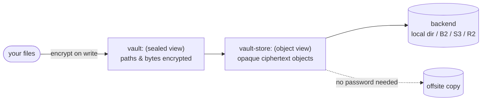
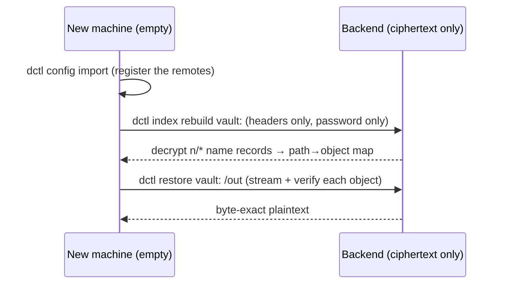

# DCTL user guide

A practical, task-first walkthrough of DCTL — how to build it, create an
encrypted vault, put and get files, and (the headline) restore a vault onto a
brand-new machine with nothing but the password.

This guide favours **runnable examples** over prose. Every command below is a
real invocation against the CLI surface as it stands today; where a feature is
partial or not yet wired up, it is flagged **WIP** rather than shown working.

> **Read this first — DCTL is early software.** The library crates are green and
> the CLI happy path (`init` → `copy` → `cat`/`ls` → `verify` → `index rebuild`
> → `restore`) is exercised by an end-to-end smoke test on the **local** backend.
> Several commands and flags are stubs or parse-but-do-nothing; each is called
> out where it appears. **Live B2 / S3 / R2 has not been verified end to end** —
> the code paths exist and are unit-tested, but the integration tests are
> `#[ignore]` + credential-gated. Treat cloud bases as unproven until you have
> run your own round-trip.

**Related docs:** [README](README.md) · [Architecture](ARCHITECTURE.md) ·
[Security](SECURITY.md) · [Crates](CRATES.md) · [Development](DEVELOPMENT.md) ·
[Format spec](FORMAT.md) · [Global flags](GLOBAL_FLAGS.md) ·
[Command reference](commands/README.md) · [Exit codes](EXIT_CODES.md) ·
[Error codes](ERROR_CODES.md)

---

## 1. Install / build

DCTL is a Rust workspace on **edition 2024**. There are no published binaries
yet; build from source.

```sh
git clone <your-clone-url> DCTL
cd DCTL

cargo build --release        # builds the whole workspace
cargo test                   # unit + property + CLI smoke tests
```

The CLI binary is `dctl`. After `cargo build --release` it lives at
`target/release/dctl`. To put it on your `PATH`:

```sh
cargo install --path crates/dctl-cli   # installs `dctl` into ~/.cargo/bin
dctl version
```

Requires a recent stable toolchain (`rustup update`). See
[DEVELOPMENT.md](DEVELOPMENT.md) for the full test / clippy / fuzz matrix.

Throughout this guide `dctl` means "the binary you just built" — substitute
`./target/release/dctl` if you have not installed it.

---

## 2. Concepts you need before the first command

### Two remotes per vault: the sealed view and the object view

`dctl init` registers **two** remotes for one vault, and understanding the split
is the key to everything else.



| Remote | Example | What it is | Needs password? |
|--------|---------|------------|-----------------|
| **vault** (sealed) | `vault:` | The encrypting front door. Everything written through it is sealed; nothing turns that off. Paths *and* contents are encrypted. | Yes |
| **store** (object) | `vault-store:` | The opaque ciphertext objects exactly as they sit on the backend (`system/envelope.bin`, `o/<id>`, `n/<hash>`, …). | No |

The store view is what makes offsite replication possible **without decryption
capability** — a backup operator can copy ciphertext to a second provider
(`dctl replicate`) and never hold the password. See
[dctl init](commands/dctl_init.md) and [dctl replicate](commands/dctl_replicate.md).

### `REMOTE:PATH` addressing

Every target is written `name:path`, rclone-style. `vault:photos/2024` is the
`photos/2024` subtree inside the vault named `vault`; a bare `vault:` is the
whole dataset. Remote names are **at least two characters**, so `C:\data`,
`d:/data` and `\\server\share` always parse as **local paths on every platform**,
never as a remote called `C`. A local operand is just an ordinary path.

### The index

DCTL keeps a local **encrypted index** database (default file `vault.redb` in the
platform data dir; this guide pins it explicitly with `--index`). The index is a
**cache and a privacy layer, never a single point of failure**: every fact in it
is re-derivable from the backend's encrypted name records (`n/*`). Losing the
index never means losing data — you rebuild it (see §7). Keeping the mapping
local is also what stops the provider from learning the shape of your dataset.

### Verified-write (the durability contract)

Nothing is reported "stored" until its bytes are **checksum-verified at the
destination** *and* the index commit has landed. The index commit is the single
act that makes a file count as stored. A checksum mismatch **hard-aborts** before
the commit: the staged object is deleted, the source is left untouched, and
nothing is reported as transferred (exit **20**, `checksum_mismatch`). There is
no half-stored file and no false "copied".

### Verify modes: `checksum` / `sample` / `strict`

How hard DCTL re-checks a stored object is the global `--verify` dial (also a
per-remote `verify =` setting in the config). The same dial governs `copy`'s
post-write check, `dctl verify`, and `dctl scrub`.

| `--verify` | What it does | What it proves | Extra egress |
|------------|--------------|----------------|--------------|
| `checksum` *(default)* | Compares the provider's stored checksum against the locally computed one. | The provider still holds the ciphertext you sent. | none |
| `sample` | Additionally range-reads and decrypts `--verify-samples` chunks per object. | Those chunks decrypt and authenticate. | partial |
| `strict` | Reads and decrypts **every** object in full and confirms its whole-file BLAKE3. | The plaintext is intact, end to end. | **full — a second copy of the data** |

Two honest caveats for this build:

- **`sample` and `strict` are currently identical** — both re-read the whole
  object; partial sampling is not wired up yet, so **`--verify-samples` is parsed
  but not consulted (WIP)**.
- `strict` over a whole vault downloads the whole vault. The integrity commands
  warn before a byte-reading mode meets a prefix.

See [Global flags → Durability](GLOBAL_FLAGS.md#durability) and
[dctl verify](commands/dctl_verify.md).

### Passwords and non-secret config

The password is resolved in a fixed order, most explicit first:

```
--password / DCTL_PASSWORD  →  --password-command  →  --password-file  →  interactive prompt
```

For scripts and containers use **`DCTL_PASSWORD`** (this guide does). Add
`--no-ask-password` to any unattended job so it fails fast (exit **22**) instead
of hanging on an invisible prompt. The config file holds **non-secret settings
only** — remote names, types, buckets, endpoints, policy defaults. Provider
credentials come from the environment (`DCTL_B2_KEY_ID`, `DCTL_B2_APP_KEY`, S3/R2
equivalents); the vault password is never written anywhere.

> **`--key-file` (two-factor) is WIP and refused.** The engine derives the key
> from the password alone in this build, so `--key-file` fails with exit **7**
> at both `init` and every unlock rather than silently creating a one-factor
> vault. See [Global flags → `--key-file`](GLOBAL_FLAGS.md#--key-file-path).

### A note on the examples

To keep every vault self-contained and away from your real config, the examples
pin `--config` and `--index` explicitly and feed the password through the
environment — exactly as the end-to-end smoke test does:

```sh
export DCTL_PASSWORD='correct horse battery staple'
export DCTL_CONFIG="$HOME/dctl-demo/config.toml"
export DCTL_INDEX="$HOME/dctl-demo/index.redb"
mkdir -p "$HOME/dctl-demo"
```

`DCTL_CONFIG` / `DCTL_INDEX` are the environment spellings of the `--config` /
`--index` flags; setting them once means the commands below need neither flag.
Drop them to use the platform default locations.

---

## 3. Create a vault

```sh
dctl init --name vault --base local:/srv/vault
```

This does two things at once (see [dctl init](commands/dctl_init.md)):

1. **Creates the vault** — a 256-bit root key from the system CSPRNG, wrapped
   under your password with Argon2id, written as `system/envelope.bin`; then the
   local index database.
2. **Registers both remotes** — the sealed `vault:` and the object `vault-store:`
   (the store is named `<name>-store` unless `--store-name` overrides it).

```console
$ dctl init --name vault --base local:/srv/vault
created:
  [remotes.vault-store]  type = local  path = /srv/vault  require_vault = true
  [remotes.vault]        type = vault  base = vault-store
```

Things worth knowing:

- **The password is typed twice at a terminal** (no confirmation when it comes
  from `DCTL_PASSWORD`/`--password-*`, since re-reading a source is not a check).
  **There is no password-recovery path** — lose it and the data is
  unrecoverable, by design.
- Minimum password length is **8 characters** (enforced at creation only).
- An existing index, or a store that already holds an envelope, is a **hard
  refusal** without `--force`. `init` probes the store first with a tiny ranged
  GET and refuses to overwrite a vault that is already there.
- `--base` names a *place*, not an existing remote. Bare paths, `C:\…`,
  `\\server\share` and `local:/…` are local; `b2:`, `s3:`, `r2:` name a bucket.

> **Cloud bases exist but are live-unverified.** `--base b2:my-bucket`,
> `--base s3:my-bucket`, `--base r2:my-bucket` are accepted and wired to real
> backends, but end-to-end round-trips against live providers have **not** been
> verified in this build. The **local** backend is fully exercised. Credentials
> for cloud bases come from `DCTL_B2_KEY_ID` / `DCTL_B2_APP_KEY` (and S3/R2
> equivalents) in the environment.

---

## 4. Put & get files

### Put a tree into the vault

```console
$ dctl copy /srv/photos vault:
Action        Size  Path
-------  ---------  ------------------------
copy     293.0 KiB  2024/a.jpg
copy          10 B  README.md
copy           9 B  notes/café.txt
```

Each file is sealed, written through the verified-write path, and committed to
the index. `copy` is the general two-place transfer; the destination is treated
as a **container** (`report.pdf` → `vault:archive/report.pdf`). Filesystem →
filesystem, filesystem → vault, vault → filesystem, and filesystem → plain remote
all work today. See [dctl copy](commands/dctl_copy.md).

For an archive of a local tree, [`dctl backup`](commands/dctl_backup.md) is
`copy` plus a **filename pre-flight** (catches names that will break a future
restore — case collisions, Windows-illegal names, `MAX_PATH`) and **constant-
memory streaming** with no whole-file size limit. See §8.

### Put a single file under an exact name

```console
$ dctl copyto /srv/build/app-1.4.2.tar.gz vault:releases/latest.tar.gz
Action      Size  Path
------  --------  ------------------------------------
copy    1.91 MiB  app-1.4.2.tar.gz -> releases/latest.tar.gz
```

`copyto` treats the destination as the object's **name**, not a container — the
verb for "upload this and call it that". See
[dctl copyto](commands/dctl_copyto.md).

### Get files back out

Pull a subtree to disk with `copy` in the other direction:

```sh
dctl copy vault:photos /srv/export
```

Or stream a single object to stdout with [`dctl cat`](commands/dctl_cat.md) —
stdout carries object bytes and **nothing else** (progress and warnings go to
stderr), so it pipes cleanly:

```sh
dctl cat vault:releases/latest.tar.gz | tar -tzf -
dctl cat vault:film.mkv --progress | ffplay -
dctl cat vault:notes/café.txt --head 200        # first 200 bytes
```

Range flags (`--head`, `--tail`, `--offset`, `--count`) are honoured, and they
cost what they ask for on a **sealed** object too: a window is served by fetching
only the chunks covering it — `O(window)` egress and memory, not `O(object)`.
Each returned byte is authenticated by its own chunk tag; the whole-object hash
covers bytes a window never reads, so [`dctl verify`](commands/dctl_verify.md)
remains the command that checks it. The write half of the pipe family is
[`dctl rcat`](commands/dctl_rcat.md).

---

## 5. List

```console
$ dctl ls vault:
 293.0 KiB 2024/a.jpg
      10 B README.md
       9 B notes/café.txt
```

One line per object, recursive, paths relative to the spec. The size column is
human-formatted (`--units decimal` for `GB` instead of `GiB`); for arithmetic use
`--json`, where `Size` is an exact integer (or `null` when unknown — see §7).
Related listing verbs: [`lsl`](commands/dctl_lsl.md) (with times),
[`lsd`](commands/dctl_lsd.md) (directories), [`lsjson`](commands/dctl_lsjson.md),
[`tree`](commands/dctl_tree.md), [`size`](commands/dctl_size.md).

---

## 6. Verify

Re-ask the verified-write question on demand against already-stored objects.
Nothing is transferred, nothing is repaired.

```console
$ dctl verify vault:
Status      Size  Path
------  --------  --------------
ok      293.0 KiB 2024/a.jpg
ok           10 B README.md
ok            9 B notes/café.txt
```

```sh
dctl --verify strict verify vault:      # read & decrypt every object in full
dctl verify vault:releases              # just one subtree
```

Verdicts are kept distinct — `ok`, `corrupt` (real damage → exit **21**),
`missing` (index has it, provider does not), `unreadable` (provider never
answered) — because the operator's next move differs for each. The worst verdict
in the run sets the exit code. See [dctl verify](commands/dctl_verify.md);
[`scrub`](commands/dctl_scrub.md) and [`check`](commands/dctl_check.md) are the
related integrity/comparison verbs.

---

## 7. Cross-device restore — the headline workflow

**A lost index never means lost data.** Everything needed to reconstruct the
path→object mapping lives in the backend's encrypted name records. A new laptop,
a wiped machine, or a corrupted database needs exactly two things to become fully
functional: **the password** and **the backend**.



### End to end

Imagine the original machine from §3–§4 is gone. On the **new** machine you have
only the backend (here a local dir `/srv/vault`, but the shape is identical for a
cloud store) and the password.

**1. Point at a fresh, empty index and register the remotes.** If you still have
the `config.toml`, copy it over. If not, re-declare the remotes against the same
location — `config import` probes the store and wires up both views:

```sh
export DCTL_PASSWORD='correct horse battery staple'
export DCTL_CONFIG="$HOME/recovered/config.toml"
export DCTL_INDEX="$HOME/recovered/index.redb"      # does not exist yet
mkdir -p "$HOME/recovered"

dctl config import local:/srv/vault --name vault
```

**2. Rebuild the index — password only, no file bodies downloaded.** It lists and
decrypts every `n/*` record for the authoritative mapping, then reads each
object's **header** for the size, the modification time and the content hash it
was sealed with. Both reads are bounded, so this costs a listing plus a few
kilobytes per object — not a restore.

```console
$ dctl index rebuild vault:
Files  Unmeasured  Index
-----  ----------  ------------------------------------
    3           0  /home/you/recovered/index.redb
```

The **file count is the point** — compare it against what you expected the vault
to hold. Zero means the scan ran and found nothing; fewer than last time is the
signal that objects went missing at the provider. `Unmeasured` counts the paths
whose object could not be read back at all; when it is not zero the run warns and
exits **6**.

**3. List — the map is back, with its sizes and times.**

```console
$ dctl ls vault:
   1.2 MiB 2024/a.jpg
      28 B README.md
      19 B notes/café.txt
```

This listing is indistinguishable from one taken before the machine was lost,
which is the whole point: `dctl check --checksum` against the original tree
matches, and the next `dctl sync` transfers only what changed. An object the
rebuild could not read back would print `-` instead — honest rather than a
misleading `0 B` — and would be counted in `Unmeasured` above.

**4. Restore, streamed and verified.** Every object is streamed into a temporary
sibling of its destination and renamed into place **only after the whole object
authenticates** — a mismatch leaves no destination file at all (exit **21**).
Peak memory is `O(chunk)` per file, so the largest object restores on a laptop.

```console
$ dctl restore vault: /srv/out
Action        Size  Path
-------  ---------  --------------------------------------------------------------
restore       10 B  vault:README.md -> /srv/out/README.md
restore        9 B  vault:notes/café.txt -> /srv/out/notes/café.txt
restore  293.0 KiB  vault:2024/a.jpg -> /srv/out/2024/a.jpg

 Transferred: 293.0 KiB / 293.0 KiB, 100%, 54.1 KiB/s
       Files: 3 / 3
      Errors: 0
     Elapsed: 5s

$ diff -r /srv/photos /srv/out && echo IDENTICAL
IDENTICAL
```

`restore` **pre-flights every path before writing a byte** and reports *all*
problems, not just the first — case collisions, control characters, Windows-
illegal names, `MAX_PATH`, directory/file conflicts. Rehearse before the day you
need it:

```sh
dctl restore vault: /srv/restore-drill --dry-run
```

Overwriting an existing tree is gated three ways: `--immutable` refuses; without
`--overwrite` a restore that would replace anything refuses and names the count
(exit **7**); with `--overwrite` it still passes through the destructive
confirmation gate. Restore part of a vault with `--include`/`--exclude`, and
proceed past unwritable names with `--skip-unwritable`. See
[dctl restore](commands/dctl_restore.md) and [dctl index](commands/dctl_index.md).

> **WIP: point-in-time restore.** `--at` / `--snapshot` are refused (exit **7**)
> — the index records one current version per path in this build. The versioned,
> snapshot-backed index is a later phase; the flags are validated first so a
> malformed value is still a clean usage error.

---

## 8. Back up & restore a tree

`dctl backup` is the archival verb — `copy` plus a name pre-flight and
constant-memory streaming, so there is **no whole-file size limit** (unlike
`copy`, which buffers and caps at 1 GiB).

```console
$ dctl backup /srv/home vault:
warning: portability: 'notes/report:final.pdf' contains ':', which Windows does not allow in a filename
Action        Size  Path
-------  ---------  -----------------
backup   1.20 GiB  video/holiday.mkv
backup      4.0 KiB notes/report:final.pdf
```

Portability findings are **warnings, not refusals** (a legal local file is not
withheld to protect a machine that may never exist), with two exceptions: a
**control character** in a name is always fatal, and `--strict-names` turns any
finding into a refusal (exit **7**) — use it when the restore target is known to
be Windows. One bad file is counted, named, and skipped (exit **6**); a fatal
error stops the run. See [dctl backup](commands/dctl_backup.md).

Restore the tree with §7's `dctl restore`. The pair — `backup` writes the archive
with restore-time names checked up front, `restore` reads it back streamed and
verified — is the round-trip DCTL exists for.

> **WIP: `--snapshot` is refused on a real run** (exit **7**); a `--dry-run`
> still plans and names it. Same later phase as `restore --at`.

---

## 9. Sharing (asymmetric recipients)

DCTL has a full asymmetric-sharing layer in the **format and the library**, and
it is worth understanding even though the **CLI does not expose it yet**.

**Concept.** An object can be wrapped for one or more **recipients** identified by
a public key, using a post-quantum **hybrid** scheme (X25519 + ML-KEM-768, an
X-Wing-style combiner) so that a recipient reads it with their own key rather than
the vault password. A **grant sidecar** (`g/<file_id>`) lets you **add or remove
recipients without re-uploading** the object; a public **recipient registry**
(`r/`) and a **discovery** namespace (`d/`) let recipients find what has been
shared with them.

**What is where, honestly:**

| Capability | Status |
|------------|--------|
| Hybrid recipient wrap (`kem_id=1`), grant sidecar add/remove, discovery, imported keypairs (multi-identity open) | **Library-level** — implemented in `dctl-core` / `dctl-crypto`, no `dctl` subcommand |
| `dctl share …` CLI verbs | **Not present** in this build |

So today sharing is something you drive programmatically against the crates, not
from the command line. See [Architecture](ARCHITECTURE.md) and
[FORMAT.md §12–§14](FORMAT.md) for the on-disk shapes.

**Honest limits of v1 sharing** (see [SECURITY.md](SECURITY.md)):

- Sharing assumes a **shared backend** — the recipient reads the owner's store.
- The recipient↔object **sharing-graph edge is list-visible metadata**: `key_id`s
  appear in cleartext in `g/*` and in `d/` path components. Object **size is not
  backend-confidential** (it equals the cleartext DSF1 plaintext length).
- **No forward secrecy** against root- or recipient-key compromise (static
  recipients at rest, by design). **No sender authentication** in v1 —
  `kem_id=1` gives confidentiality + integrity, not origin authenticity.

---

## 10. Huge files & delegated uploads (concept)

**Streaming is the default posture.** Sealed writes go through the core's
streaming store (`Vault::put_file_from_path`): the source is sealed straight from
disk into a temporary object and handed to the backend's streaming, constant-
memory multipart write. No stage holds the whole file or the whole object, so
peak memory is `O(chunk)` regardless of size, and part sizing adapts (up to
`MAX_PARTS = 10_000`). This is why `backup` has no whole-file size limit and why
the largest object in a vault restores on a laptop. `cat`/`rcat` are the
constant-memory byte-stream pair for pipelines.

**Delegated (presigned) uploads** are a format-level capability (a transient
"upload ticket", FORMAT §12.9): a client can be handed a short-lived presigned
target and push ciphertext straight to the provider without the orchestrator
relaying the bytes. One honest wrinkle: B2 addresses parts by SHA-1 while DCTL
hashes with SHA-256, so a B2 delegated upload uses a `do_not_verify` SHA-1
sentinel at presign time and is **verified instead on the later open**. This is a
library/format capability; the delegated-upload orchestration is not a
first-class CLI verb in this build.

> **WIP: `dctl mount`** (a FUSE-style filesystem view) is present as a command
> but is a stub/partial in this build — do not rely on it. See
> [dctl mount](commands/dctl_mount.md).

---

## 11. Troubleshooting

### "vault_locked" / exit 22 — DCTL cannot get the password

Sources are tried `--password`/`DCTL_PASSWORD` → `--password-command` →
`--password-file` → prompt. An **exported-but-empty** `DCTL_PASSWORD` is treated
as unset (a blank value is almost always a failed CI interpolation). For
unattended jobs set `--no-ask-password` so a missing password fails immediately
instead of hanging on an invisible prompt. Only one trailing newline is stripped
— leading/interior whitespace is part of the passphrase. `dctl -v …` reports
which source supplied the value.

Beware the addressing quirk in some transfer paths: a vault name used *positionally*
may be resolved as a **directory relative to the working directory** rather than a
configured remote in certain unfinished code paths — if an unlock fails with exit
22 where you expected it to succeed, confirm the remote is actually registered
(`dctl config show`) and that you are running from the right directory.

### `ls`/`size` show `-` or `null` after a disaster-recovery rebuild

Not expected any more, and worth investigating. A rebuild reads each object's own
header and records the size, the time and the content hash, so a row that is
still unmeasured is one whose object could not be read back at all — the rebuild
counts those under `Unmeasured` and exits **6** rather than reporting a clean
run. Run `dctl scrub` on the remote to find out whether the object is missing at
the provider or sealed with a metadata schema this build cannot parse.

The rendering itself is correct either way: an unmeasured row prints `-` (text) /
`null` (JSON), never a fake `0 B`, and the bytes are still fine — `cat`,
`restore`, `verify` and `scrub` all read the object directly.

### `cat`/`scrub` says a file is `missing`, or an object was written elsewhere

If an object was stored from a **different machine** and your local index has
never seen it, or your index is stale, the fix is the recovery path:

```sh
dctl index rebuild vault:
```

The backend is the authority; a rebuild reconciles the local index against it.
A rebuild that finds **fewer** files than expected is the real "objects are
missing at the provider" signal.

### A transfer aborted with exit 20 (`checksum_mismatch`) or 21 (`integrity_failure`)

That is the verified-write / verify contract doing its job. **20** means the
bytes the backend stored did not match what DCTL sent — nothing was committed and
the source is untouched; retry the transfer. **21** means stored ciphertext did
not decrypt/authenticate, or a restored object's hash did not match — that is
real corruption; the offending object is named. Neither ever exits 0.

### `--immutable` refused a run with exit 7

The destination already holds objects the run would replace or delete.
`--immutable` allows only additions; re-run with `--dry-run` (and without
`--immutable`) to see exactly which paths triggered it, then point elsewhere or
drop the flag.

### Flags that "do nothing"

Several flags **parse and validate but are not yet honoured** in this build — the
whole [Transfer group](GLOBAL_FLAGS.md#transfer) (`--transfers`, `--bwlimit`,
`--retries`, `--timeout`, …) and `--verify-samples`. They never silently degrade
a guarantee; where honouring a flag matters for correctness (`--key-file`), the
command **fails** instead of proceeding. See
[Global flags → Flags that parse but do not yet act](GLOBAL_FLAGS.md).

### Exit codes

Every command's exit code is a published contract — script against it. Common
ones: **0** success, **1** usage error, **6** partial failure, **7** fatal error,
**9** nothing transferred/covered, **20** checksum mismatch, **21** integrity
failure, **22** vault locked, **25** cancelled. Full table:
[EXIT_CODES.md](EXIT_CODES.md). FFI-stable error codes:
[ERROR_CODES.md](ERROR_CODES.md).

---

## 12. Where to go next

- **Every command, flag by flag** — [commands/README.md](commands/README.md)
- **Every global flag** — [GLOBAL_FLAGS.md](GLOBAL_FLAGS.md)
- **How the crates fit together** — [ARCHITECTURE.md](ARCHITECTURE.md) ·
  [CRATES.md](CRATES.md)
- **Threat model & guarantees** — [SECURITY.md](SECURITY.md)
- **On-disk format (20-year decodability)** — [FORMAT.md](FORMAT.md)
- **Building, testing, contributing** — [DEVELOPMENT.md](DEVELOPMENT.md)
- **Audit trail** — [AUDIT_LOG.md](AUDIT_LOG.md) ·
  **Project status** — [PROJECT_STATUS.md](PROJECT_STATUS.md)
