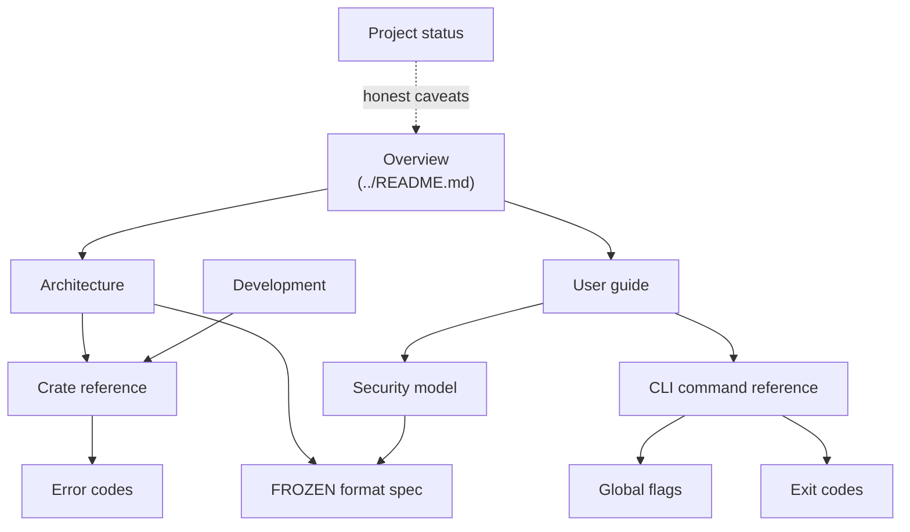

# DCTL Documentation

**DCTL** is an rclone-style, streaming-first, **encrypted** multi-cloud transfer, backup, and
stream tool with post-quantum-ready cryptography. Content **and** path names are encrypted at rest;
huge files stream in constant memory; and the on-disk format is frozen so data stays restorable for
the long term.

This page is the map to the rest of the docs. Not sure where to start? Read the
[overview](../README.md) first, then jump to whichever section below matches what you're trying to
do.

> **Project maturity.** DCTL is a work in progress. The library crates are green and the CLI happy
> path (`init` → `copy` → `cat` → `verify` → cross-device restore) is smoke-tested on the local
> backend. Some CLI commands are still partial or stubbed (e.g. `mount`), and live B2 / S3 / R2 has
> **not** yet been verified end-to-end. See [PROJECT_STATUS.md](PROJECT_STATUS.md) for the current,
> honest state before relying on any single capability.

---

## Start here

Orientation and day-to-day usage. Read these top-to-bottom the first time.

| Doc | What it is | Read this if… |
|-----|------------|---------------|
| [Overview](../README.md) | Top-level project README: what DCTL is, its goals, and a quick taste of the CLI. | …you're brand new and want the one-screen pitch. |
| [Architecture](ARCHITECTURE.md) | How the pieces fit: the crate stack, the Vault composition (crypto + store + index), and the data-flow of a put/get. | …you want the mental model of how a transfer actually happens end-to-end. |
| [User guide](GUIDE.md) | Task-oriented walkthrough: initialize a vault, copy/sync files, stream, verify, and restore on a fresh device. | …you want to *use* DCTL and follow along with real commands. |
| [Security model](SECURITY.md) | The threat model, what the encryption does and does **not** protect, and the metadata / side-channel caveats. | …you need to know exactly what "encrypted" guarantees here (and what it doesn't). |

## Reference

Look-it-up material. Precise, and meant to be linked into rather than read cover-to-cover.

| Doc | What it is | Read this if… |
|-----|------------|---------------|
| [CLI command reference](commands/README.md) | Index of every `dctl` subcommand, each with its own detailed page. | …you need the exact flags, arguments, and behavior of a specific command. |
| [Global flags](GLOBAL_FLAGS.md) | Flags that apply across all commands (config, logging, concurrency, backend selection, etc.). | …you're building a real command line and need the shared options. |
| [Crate reference](CRATES.md) | The eight workspace crates, their responsibilities, and the public boundaries between them. | …you're reading or extending the source and need to know which crate owns what. |
| [Error codes](ERROR_CODES.md) | The FFI-stable error-code contract surfaced by the library. | …you're handling or mapping DCTL errors programmatically. |
| [Exit codes](EXIT_CODES.md) | The CLI exit-code contract for scripting and automation. | …you're wiring `dctl` into scripts, CI, or backup jobs. |
| [Audit log](AUDIT_LOG.md) | The structured audit-log format and what operations are recorded. | …you need to trace or verify what a vault has done. |
| [Restore drill](RESTORE_DRILL.md) | The full-recovery exercise — destroy the index, rebuild it from the store, restore on the recovery phrase alone — what each step proves, and the record of the last run. | …you are being audited, or you want to know whether the backup actually restores. |
| [FROZEN format spec](FORMAT.md) | The design-locked v1 on-disk/wire format: DKE1 envelope, DSF1 objects, §5 name records, the §12 asymmetric sharing layer, and more. | …you're implementing a decoder, doing forensics, or need ground-truth for long-term restorability. |
| [Project status](PROJECT_STATUS.md) | The current, deliberately honest state: what's green, what's WIP, and what's unverified. | …you're deciding whether to depend on a given feature today. |

## Design & plans

Rationale and forward-looking documents. Useful for contributors and reviewers; not needed to use
DCTL.

| Doc | What it is | Read this if… |
|-----|------------|---------------|
| [Development](DEVELOPMENT.md) | How to build, test, and contribute: workspace layout, test strategy, and conventions. | …you want to build from source or send a change. |
| [PLAN.md](../PLAN.md) | The design plan and roadmap for DCTL as a whole. | …you want the "why it's built this way" and where it's headed. |
| [PLAIN_STORAGE_PLAN.md](PLAIN_STORAGE_PLAN.md) | The design plan for the plaintext / plain-storage path. | …you're interested in the non-encrypted storage design specifically. |

---

## How the docs relate

## Reading paths

- **"I just want to back up files."** [Overview](../README.md) →
  [User guide](GUIDE.md) → [CLI command reference](commands/README.md) →
  [Global flags](GLOBAL_FLAGS.md).
- **"Is this actually secure enough for my data?"** [Security model](SECURITY.md) →
  [FROZEN format spec](FORMAT.md) → [Project status](PROJECT_STATUS.md) (for what's verified vs.
  WIP).
- **"I want to contribute or read the code."** [Architecture](ARCHITECTURE.md) →
  [Crate reference](CRATES.md) → [Development](DEVELOPMENT.md) → [PLAN.md](../PLAN.md).
- **"I need to restore data 20 years from now."** [FROZEN format spec](FORMAT.md) — the format is
  design-locked, and a dependency-free C99 reference decoder plus KAT cross-validation exists to
  prove restorability.
