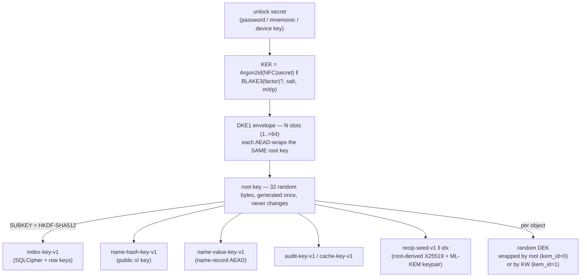

# DCTL Security Model & Threat Model

This document describes **what DCTL protects, how, and — just as importantly — what it
does not protect**. It is deliberately hedged: every claim here is traceable to the frozen
on-disk format ([`FORMAT.md`](./FORMAT.md)) and to the crypto source in
[`crates/dctl-crypto`](../crates/dctl-crypto). Where a guarantee is partial or a side
channel exists, it is stated plainly rather than glossed over.

For byte-level layouts see [`FORMAT.md`](./FORMAT.md); for the FFI-stable error codes a
verifier will observe see [`ERROR_CODES.md`](./ERROR_CODES.md); for the crate map see
[`CRATES.md`](./CRATES.md) and [`ARCHITECTURE.md`](./ARCHITECTURE.md).

> **Status caveat.** The library crates are tested and green; the CLI is a work in progress
> (see [`PROJECT_STATUS.md`](./PROJECT_STATUS.md)). **Live B2 / S3 / R2 backends have NOT
> been verified end-to-end** — those integration tests exist but are `#[ignore]`d and
> credential-gated. The local backend is fully exercised, and cross-device restore is
> proven by a real CLI smoke test. Nothing in this document should be read as a claim that
> the whole product has been audited.

---

## 1. Threat model at a glance

DCTL is an **encrypt-before-upload** tool. The design assumption is that the storage
backend is **untrusted** — it may be a public cloud bucket, a shared server, or an
adversary who has stolen the raw bytes. The primary secret is a **password** (or mnemonic /
device key) that never leaves the client.

| Adversary | Capability | Outcome |
|---|---|---|
| **Hostile backend / stolen bucket** | reads & tampers with every stored byte, sees all `LIST` output | Cannot read content or paths; tampering is detected on open (AEAD). **Can** see object count, per-object sizes, and the sharing-graph key-ids (§6). |
| **Network eavesdropper** | passive/active MITM on the wire | Content is already encrypted at rest; transport additionally offers hybrid PQ TLS (`dctl-store`), but confidentiality does **not** depend on TLS. |
| **Offline password-guessing attacker** | has the stolen envelope + object bytes | Must break Argon2id (128 MiB, adaptive) per guess; see §2. |
| **Harvest-now-decrypt-later quantum adversary** | stores ciphertext today, has a CRQC later, does **not** have the vault root | Symmetric owner path (`kem_id=0`) is already PQ-safe; shared/recipient path (`kem_id=1`) is protected by the ML-KEM-768 leg of the hybrid (§3). |
| **Recipient-key or root-key compromise** | later obtains the long-term private key / root | **Recovers all past objects** encrypted to that key. There is **no forward secrecy** — by design (§5, §6). |
| **Malicious sharer** | holds a recipient's public key | Can seal an object that recipient will accept; the recipient **cannot** verify who sealed it (no sender authentication in v1, §6). |
| **Local forensic actor** | reads swap / core dumps / attaches a debugger | The vault **root key** and the **name-layer keys** are held in `dctl-secmem`'s `LockedSecret` (`mlock`-pinned out of swap/dumps + zeroize-on-drop + no-`Debug`), and `PT_DENY_ATTACH` is installed at vault open on Apple release builds. **Residual:** the ephemeral per-operation DEK/`KW` and the recipient-identity keypair are still `zeroize`-on-drop only (§4.4). |

---

## 2. Key hierarchy

The full hierarchy is frozen in [`FORMAT.md §1`](./FORMAT.md#1-key-hierarchy); every
constant cited below lives in
[`crates/dctl-crypto/src/constants.rs`](../crates/dctl-crypto/src/constants.rs).



### 2.1 Password → KEK (Argon2id)

The passphrase is **NFC-normalized** and UTF-8-encoded before hashing so the same
passphrase typed on any OS yields byte-identical KDF input (a cross-device-unlock
requirement — [`kdf/derive.rs`](../crates/dctl-crypto/src/kdf/derive.rs)). An optional
binary factor is folded in as `BLAKE3(factor)`.

`KEK = Argon2id(NFC(passphrase) ‖ BLAKE3(factor)?, salt, m, t, p)` — Argon2id, **version
0x13** (RFC 9106), 32-byte output.

| Parameter | Default | Source |
|---|---|---|
| memory cost `m` | **131 072 KiB (128 MiB)** — ~10× the OWASP floor | `DEFAULT_ARGON2_M_COST` |
| time cost `t` | 3 iterations | `DEFAULT_ARGON2_T_COST` |
| parallelism `p` | 4 lanes | `DEFAULT_ARGON2_P_LANES` |
| salt | 16 bytes CSPRNG | `DEFAULT_SALT_LEN` |

Parameters are **stored per slot**, so cost can evolve without a format change. An
**adaptive calibrator** ([`kdf/calibrate.rs`](../crates/dctl-crypto/src/kdf/calibrate.rs))
targets a wall-clock unlock time on the *creating* device, scaling memory first, then time
cost if memory saturates the ceiling.

> **Cross-device caveat (normative, [`FORMAT.md §9 rule 10`](./FORMAT.md#9-normative-engineering-rules-bind-before-fficli-harden)).** A portable slot MUST
> be calibrated for the **weakest** device expected to unlock the vault, not the strongest
> that created it — otherwise that weak device cannot afford the memory/time to open it.

**Hardened parameter parsing.** Because envelope KDF params are read from *untrusted*
storage **before** the wrapped-root tag can be checked, decoders MUST reject out-of-range
params before ever running Argon2id — otherwise a corrupt slot could demand terabytes of
RAM or hours of CPU just to attempt an unlock. `validate_params` enforces frozen ceilings
(`ARGON2_MIN_M_COST=8`, `ARGON2_MAX_M_COST=1 048 576` KiB = 1 GiB, `t ≤ 16`, `p ≤ 8`) and
is called *before* the KDF runs.

#### 2.1.1 The reduced test cost, and why a shipped build cannot write it

DCTL's own suite creates and opens hundreds of vaults per run. At 128 MiB × t=3 that was
**863 seconds for one test file**, which made the project expensive to change — a defect in
its own right. A build that is **not** `--release` therefore writes the frozen §2 floor
(`m = 8 KiB, t = 1, p = 1`) into new slots instead. Nothing else changes: a slot carries the
parameters it was written with, so every assertion in the suite is identical and only the
clock moves.

That is a real weakening. A vault created under it has a brute-forceable password, opens
normally forever, and never looks wrong again — so **which cost a build writes is not a
setting anybody can reach**. Every mechanism that can be influenced from outside the source
tree was rejected:

| Mechanism | Rejected because |
|---|---|
| Cargo feature | settable with `--features`, and unified across the whole dependency graph |
| environment variable | chosen by whoever runs the binary — exactly who Argon2id defends against |
| CLI flag | the same, and documented |
| `cfg(debug_assertions)` alone | forced on in a release build by `RUSTFLAGS="-C debug-assertions=on"` or `[profile.release] debug-assertions = true` |
| any custom `cfg` | settable with `--cfg` |

Instead the cost is fixed at **build time** by
[`kdf/gate.rs`](../crates/dctl-crypto/src/kdf/gate.rs) from Cargo's `PROFILE`, which Cargo
computes itself, hands only to build scripts, and does not let the environment override —
and it is baked in as **generated source**, not as a `cfg`, so there is nothing on a command
line to flip. A **second, independent** gate (`const _: () = assert!(…)` in
[`kdf/cost.rs`](../crates/dctl-crypto/src/kdf/cost.rs)) refuses to *compile* the reduced cost
into any build without debug assertions. Reaching it requires editing the source tree.

[`tests/kdf_cost.rs`](../crates/dctl-crypto/tests/kdf_cost.rs) checks every link, including
by building a probe crate under `PROFILE=debug cargo build --release` and under forced debug
assertions, and — the one that settles it — by compiling this crate with `--release` and
asking the resulting binary which cost it would write.

**The residual, stated plainly.** A binary somebody compiled *themselves* without
`--release` — including `cargo install --debug` — does write reduced-cost vaults. That is
the intended behaviour, not an oversight: the guarantee is about what a **released** DCTL
can be made to do, and no distributed artifact is built that way. It is also why such a
build says so twice — as a `cargo::warning` when it is compiled, and again from `dctl init`
(and the password replacement inside `dctl vault recover`) at the moment a slot is created,
naming both costs and the command that fixes it. That is the last moment anyone can be told,
because the parameters are permanent from then on.

### 2.2 KEK → root key (DKE1 slot envelope)

The envelope ([`FORMAT.md §2`](./FORMAT.md#2-envelope-dke1--self-delimiting-key-slot-list),
[`envelope/`](../crates/dctl-crypto/src/envelope/)) is a self-delimiting list of **1..=64
slots** (`MAX_SLOT_COUNT`). Every slot — password, mnemonic, device, (reserved) Shamir —
independently AEAD-wraps the **same** 32-byte root key under its own KEK
(`wrapped_root = XChaCha20-Poly1305(KEK, root_key, AAD)`).

The wrap **AAD** binds the 16-byte `vault_id` and *every* wrap/KDF selector
(`slot_type`, `flags`, `kdf_id`, `wrap_algo`, length-framed `salt` and `aux`). This is
anti-downgrade and anti-transplant: a slot cannot be moved to another vault, and an
attacker cannot forge a weaker algorithm selector without breaking the tag
([`envelope/wrap.rs`](../crates/dctl-crypto/src/envelope/wrap.rs)).

### 2.3 root key → sub-keys (HKDF-SHA512)

Purpose-specific keys are HKDF-expanded from the root under distinct `info` labels, so
leaking one sub-key cannot recover another
([`keys/subkey.rs`](../crates/dctl-crypto/src/keys/subkey.rs)).

`SUBKEY(ikm, info)` = **RFC 5869 HKDF-SHA512** in full (Extract **then** Expand), salt = 64
zero bytes, `L = 32`. The exact same construction is reused by the §12 KEM combiner (with a
64-byte IKM), guaranteeing bit-for-bit agreement with the spec. Frozen labels include
`index-key-v1`, `name-hash-key-v1`, `name-value-key-v1`, `audit-key-v1`, `cache-key-v1`,
and `object-keying-v1` (reserved).

The **per-object DEK is random**, not HKDF-derived, and is wrapped by the root
(`kem_id=0`) or by a per-object recipient key `KW` (`kem_id=1`). Chunks and metadata are
both sealed under the DEK in **disjoint nonce spaces** — the 24-byte nonce's `byte[23]` is a
domain marker (`0x00` chunk / `0x01` metadata,
[`object/nonce.rs`](../crates/dctl-crypto/src/object/nonce.rs)), and chunk nonces are
`base_nonce XOR counter`, so no `(key, nonce)` pair ever repeats
([`FORMAT.md §11`](./FORMAT.md#11-security-considerations)).

---

## 3. Post-quantum posture

### 3.1 Symmetric owner path (`kem_id=0`) — already quantum-resistant

The default at-rest path is **all-symmetric**: Argon2id + XChaCha20-Poly1305 + BLAKE3, all
256-bit. Grover's algorithm only halves the effective margin, which remains comfortable.
No public-key operation is involved, so there is nothing for a harvest-now-decrypt-later
adversary to break later. **This is the path the 20-year self-restorable-archive guarantee
rests on** (the dependency-free C99 decoder in `dctl-decode` covers only `kem_id=0`).

### 3.2 Asymmetric recipient path (`kem_id=1`) — hybrid X25519 + ML-KEM-768

Sharing and write-only backup need a **public-key** KEM, which *is* the part a quantum
adversary could harvest now and decrypt later. DCTL uses a **hybrid** KEM
([`FORMAT.md §12.1`](./FORMAT.md), [`kem/combine.rs`](../crates/dctl-crypto/src/kem/combine.rs),
[`kem/wrap.rs`](../crates/dctl-crypto/src/kem/wrap.rs)):

- **Classical leg:** X25519 (RFC 7748), fresh ephemeral per (object, recipient), with a
  mandatory *contributory* check that rejects low-order / all-zero recipient keys.
- **PQ leg:** ML-KEM-768 (FIPS 203, k=3), derandomized encapsulation from 32 CSPRNG bytes.

The two shared secrets feed an **X-Wing-style robust concatenation combiner**:

```
wrapping_key = SUBKEY( ss_x(32) ‖ K_m(32),   // classical first, then PQ — order FROZEN
                       info = label ‖ suite ‖ head(68) ‖ key_id(32)
                              ‖ eph_pk(32) ‖ ct_m(1088) ‖ R.x_pk(32) ‖ R.ek(1184) )
```

Because the wrapping key needs **both** secrets, an algorithmic break of *either* primitive
(by a party without the vault root) leaves the other 256-bit secret unknown in the IKM. The
`info` transcript folds the full 68-byte object head, both recipient static public keys,
and the KEM ciphertexts, so any tamper of `eph_pk`/`ct_m` yields a different key and Open
fails. ML-KEM decapsulation uses **implicit rejection** (it always returns *some* `K_m`);
the `wrapped_kw` AEAD tag is the **sole** accept gate, so a wrong or tampered record
surfaces as a plain AEAD error with no decryption oracle.

> **Harvest-now-decrypt-later, precisely.** The `kem_id=1` layer buys HNDL resistance
> against a purely **quantum** adversary **without the root**: the ML-KEM leg keeps
> harvested shared objects secret even if X25519 later falls. It does **not** protect
> against an adversary who obtains the root or a recipient's long-term private key — see §5.

---

## 4. Defensive mechanisms

### 4.1 Key-committing AEAD (partitioning-oracle defense)

Plain XChaCha20-Poly1305 (and GCM) are **not** key-committing: a single ciphertext can
verify under multiple keys, which enables **partitioning-oracle** attacks that accelerate
password guessing when the same secret is wrapped under many KEKs — exactly the DKE1
multi-slot situation.

Each slot therefore carries an explicit **key-commitment**
`commit = SUBKEY(KEK, "dctl-slot-commit-v1")` (32 bytes). On unlock the decoder recomputes
the commitment and compares it in **constant time** (`subtle::ConstantTimeEq`) **before**
attempting the AEAD unwrap ([`envelope/wrap.rs`](../crates/dctl-crypto/src/envelope/wrap.rs)).
A wrong KEK fails the commitment fast with no AEAD attempt; a substituted vault/slot fails
the AEAD because the AAD binds `vault_id` and every selector.

### 4.2 AAD context-binding (anti-transplant)

Every encrypted blob in DCTL is bound to its identity via mandatory AAD, so a ciphertext
produced for one context can never be substituted into another under the same key
([`aead/`](../crates/dctl-crypto/src/aead/)). Concretely: the DEK-wrap AAD folds the full
68-byte head; the metadata and chunk AADs fold the head (chunk AAD also folds the chunk
index); the name-record AAD folds `vault_id` and the record's own backend key; the §12
recipient wraps fold the head, suite, and recipient `key_id`
([`FORMAT.md §12.8`](./FORMAT.md#128-aad-binding-anti-transplant--c-decoder-scope-frozen)). Header tampering is detected even on an empty,
footer-less object.

### 4.3 Verified-write & durability contract

DCTL reports an object as stored **only after** its bytes are checksum-verified at the
destination **and** the local index commit is durable
([`crates/dctl-core/src/lib.rs`](../crates/dctl-core/src/lib.rs),
[`crates/dctl-store/src/streaming.rs`](../crates/dctl-store/src/streaming.rs)):

1. Encrypt to a self-describing DSF1 object (constant-memory streaming for huge files).
2. Write to the backend and **verify the stored bytes match the expected checksum**; the
   streaming path stages to a temp sibling, `fsync`s, then atomically renames.
3. Only then commit the index; success is reported **after** the durable commit.

On open, each object additionally carries a whole-object **BLAKE3 footer** (redundant with
the per-chunk Poly1305 tags) that is verified before any plaintext is trusted.

> **Backend-checksum caveat.** For B2 delegated (presigned) uploads, the SHA-1 that B2
> requires is replaced with a `do_not_verify` sentinel (B2 is SHA-1; DCTL's hash is
> SHA-256); integrity is instead verified on the later open. See
> [`FORMAT.md`](./FORMAT.md) and the store crate for detail.

### 4.4 Secure memory (`dctl-secmem`)

`zeroize` wipes RAM copies but cannot help once the OS has paged a key to swap or captured
it in a core dump. [`dctl-secmem`](../crates/dctl-secmem/src/lib.rs) is the **one** crate
permitted to contain `unsafe` (every block carries a `// SAFETY:` note), isolating platform
FFI so `dctl-crypto` stays `#![forbid(unsafe_code)]`.

> **What is wired in.** `dctl-secmem` is a dependency of both `dctl-crypto` and `dctl-core`
> (`grep -r dctl-secmem crates/*/Cargo.toml`). The vault **root key** (`dctl-core`) and the two
> **name-layer sub-keys** (`dctl-crypto`, §5) — the session-long-lived raw-byte secrets — are
> held in `LockedSecret`: `mlock`-pinned, dump-excluded where the platform allows, zeroized on
> drop, and never `Debug`-printed. `apple_harden_crash_reporter()` runs **once at vault open**.
> **Residual (documented follow-up), NOT yet `mlock`'d:** (1) the *ephemeral* per-operation
> DEK / `KW` / wrapping-keys and derived subkeys live only within a single seal/open call and
> stay in `zeroize::Zeroizing` — adequate for a value that never outlives one operation; and
> (2) the recipient-identity keypair (`x25519-dalek` `StaticSecret` + `ml-kem`
> `DecapsulationKey`) are **typed** library keys that zeroize on drop but are not raw buffers —
> pinning them needs a raw-bytes store/reconstruct refactor of the KEM hot path, tracked
> separately.

- **`LockedSecret`** — a heap buffer pinned with `mlock` / `VirtualLock` on construction and
  unlocked + zeroized on drop; never `Clone` (duplicating a secret must be explicit) and never
  leaks its contents through `Debug`. It **holds** the vault root key (`dctl-core`) and the two
  name-layer sub-keys (§5) for the life of an unlocked vault. The ephemeral per-operation
  DEK / `KW` and derived subkeys still use `zeroize::Zeroizing` — they never outlive a single
  operation.
- **Dump exclusion** — `madvise(MADV_DONTDUMP)` on Linux/Android; `VM_BEHAVIOR_ZERO_WIRED_PAGES`
  on Darwin (wired pages zeroed on free).
- **Anti-debug** — `apple_harden_crash_reporter()` installs `PT_DENY_ATTACH` on Apple
  **release** builds so a forensic actor with an unlocked device cannot attach `lldb` to
  dump key memory.

> **Honest limits.** All locking is **best-effort**: unprivileged containers or a low
> `RLIMIT_MEMLOCK` can deny `mlock` (logged as a WARN, never fatal — zeroize-on-drop still
> applies). `PT_DENY_ATTACH` is Apple-release-only and is compiled out in debug builds; it is
> not a defense against an attacker with kernel privileges. Coverage is also **partial by
> design today**: only the long-lived raw-byte secrets above (root key + name-layer keys) are
> `mlock`'d — the ephemeral per-operation DEK / `KW` and the recipient-identity keypair
> (`x25519-dalek` / `ml-kem` typed keys) are `zeroize`-on-drop only, a documented follow-up.

### 4.5 Metadata-private index (SQLCipher)

The local index is a **fast, rebuildable cache**, not a source of truth — losing it never
means losing data (`dctl index rebuild vault:` rescans the backend with only the password).
It applies **two independent layers**
([`crates/dctl-index`](../crates/dctl-index/src/index.rs)):

1. **Whole-DB:** SQLCipher encrypts every page under a raw 32-byte key
   `SUBKEY(index-subkey, "index-sqlcipher-v1")`, supplied via `PRAGMA key = "x'<hex>'"` (raw
   form skips SQLCipher's PBKDF2 — the sub-key is already a strong HKDF output). A stolen
   `.db`/`.db-wal` is opaque; a wrong key fails to open (`SQLITE_NOTADB`).
2. **Per-row application AEAD:** the primary key is a **keyed** BLAKE3 hash of the path
   (`index_key = BLAKE3_keyed(SUBKEY(index-subkey, "index-keying-v1"), NFC(path))`), and the
   row value is AEAD-encrypted under a third, domain-separated sub-key
   (`"index-encryption-v1"`) with the row key bound as AAD.

Equal paths map to equal keys (point lookups work), but the at-rest database reveals
**neither the plaintext paths nor the metadata**. The three sub-keys are cryptographically
independent.

### 4.6 Name records (the authoritative restore map)

Name records ([`names.rs`](../crates/dctl-crypto/src/names.rs),
[`FORMAT.md §5`](./FORMAT.md)) are the backend-resident, rewritable path→object map that
makes cross-device restore possible. The public backend key is
`"n/" ‖ hex(BLAKE3_keyed(name-hash-key, NFC(path)))`; the value AEAD-encrypts
`file_id ‖ metadata_gen ‖ path` under a **separate** `name-value-key`, so publishing the
`n/*` keys never exposes value-encryption material. Opening a record re-verifies that its
stored path hashes back to its own key, rejecting a corrupt or transplanted record. Paths
are capped on **NFC-normalized** UTF-8 bytes (255/segment, 4096 total) for cross-device
stability.

> **Attacker-influenceable path caveat ([`FORMAT.md §11`](./FORMAT.md#11-security-considerations)).**
> A decrypted `path` (and any metadata `path_hint`) is only DEK-authenticated, not a trust
> anchor — the host MUST re-validate it against §5 rules before any filesystem use. The
> authoritative mapping is the name record, whose AEAD binds its own key and the vault.

---

## 5. Forward secrecy — there is none against key compromise (by design)

This is the single most important caveat in the whole model. DCTL is **static-recipient,
at-rest** encryption. The recipient (or owner) must be able to decrypt at an arbitrary
later time with a **long-term** secret, so forward secrecy against compromise of that secret
is *fundamentally impossible* — it is a deliberate trade for durable offline recoverability
([`FORMAT.md §11`](./FORMAT.md#11-security-considerations) and
[`§12.7`](./FORMAT.md#127-forward-secrecy-stated-precisely)):

- **Owner path (`kem_id=0`):** the root is immutable. A captured **old envelope + a
  previously-valid password** re-derives the same root — hence every DEK — **forever**.
  Removing or rotating a slot/password is **not** key rotation and does **not** revoke that
  pair (standard envelope-encryption behaviour, as in LUKS/KMS). True root rotation requires
  re-sealing under a new root and is a future container-version feature.
- **Recipient path (`kem_id=1`):** both static legs (X25519 `x_sk` and ML-KEM `dk`) are
  root-derived and long-term. The per-object X25519 **ephemeral** gives FS only against
  theft of that already-discarded ephemeral state — it does **not** protect against
  compromise of the recipient's static key. **Net: recipient-key or root compromise breaks
  the confidentiality of all past objects to that recipient.**
- **What is protected:** a **write-only agent** holds only public keys and zeroizes
  `DEK/KW/eph_sk/m` after upload, so **compromise of the uploader reveals nothing** about
  what it wrote (a forward-secrecy-like property against agent theft).

True ratcheting / receiver-side forward secrecy is explicitly out of scope for v1 and would
require a future ephemeral-recipient suite (a new `hybrid_suite`).

---

## 6. What is and is not protected

### Protected

| Asset | Protection |
|---|---|
| **File content bytes** | XChaCha20-Poly1305 per-chunk AEAD under a per-object random DEK; whole-object BLAKE3 footer. |
| **Logical paths** | Encrypted in name-record values (§4.6) and in the index (§4.5); backend keys are keyed hashes, not plaintext. |
| **Per-item metadata** (mtime, birthtime, size echo, content hash, flags) | Encrypted under the DEK inside the DSF1 object. |
| **At-rest confidentiality vs. a hostile backend** | The backend holds only ciphertext + keyed-hash names; it cannot read content or paths, and tampering is caught on open. |
| **Integrity / anti-transplant** | Every wrap's AAD binds the object head (and recipient `key_id` for `kem_id=1`); slots bind `vault_id` and all selectors. |
| **Offline-guessing resistance** | Argon2id 128 MiB adaptive per KEK; key-committing slots defeat partitioning oracles. |
| **HNDL resistance (shared objects)** | ML-KEM-768 leg of the hybrid, against a quantum adversary without the root. |

### NOT protected / known caveats

| Gap | Detail | Reference |
|---|---|---|
| **No forward secrecy vs. root/recipient-key compromise** | Static-recipient at-rest by design; a captured envelope + valid secret, or a leaked `dk`/root, decrypts **all** past objects. | §5, [`§12.7`](./FORMAT.md#127-forward-secrecy-stated-precisely) |
| **No sender authentication (v1)** | `kem_id=1` gives confidentiality + AEAD integrity but **not** origin authentication — anyone with a recipient's public key can seal an object it will accept, and the recipient cannot tell **who** sealed it. A signed-sender suite (`hybrid_suite ≥ 2`, Ed25519 + ML-DSA-65) is reserved. | [`§12.7`](./FORMAT.md#127-forward-secrecy-stated-precisely) |
| **Sharing-graph metadata is LIST-visible** | `key_id`s appear in **cleartext** in grant-sidecar contents (`g/*`) and as **path components** of discovery records (`d/<recipient_key_id>/<file_id>`). Anyone who can `LIST` the backend can reconstruct the recipient↔object sharing graph. | [`§12.8`](./FORMAT.md#128-aad-binding-anti-transplant--c-decoder-scope-frozen), [`§14`](./FORMAT.md#14-shared-object-discovery-dgd1-dhex-recipient_key_idhex-file_id--frozen) |
| **Object size is not confidential** | The DSF1 head's `plaintext_len` is **cleartext**, and `LIST` sizes reveal it too. The metadata `size` field equals it. | [`FORMAT.md §3`](./FORMAT.md) |
| **Object count & existence** | The number of objects, name records, grants, and discovery records is visible to anyone who can `LIST`. | [`FORMAT.md §8`](./FORMAT.md) |
| **Timing / size side channels** | No padding or traffic shaping; access patterns, per-object sizes, and update timing are observable to the backend. | — |
| **Attacker-influenceable decrypted paths** | A decrypted `path`/`path_hint` is only DEK-authenticated; the host must re-validate before filesystem use. | [`FORMAT.md §11`](./FORMAT.md#11-security-considerations) |
| **Shared-backend trust assumption** | Sharing/discovery assume the recipient reads the **owner's** store (`r/*`, `g/*`, `d/*` all live in the owner's backend). This is the model, not a leak, but it means recipients share a namespace with the owner. | [`§12.6`](./FORMAT.md#126-grant-sidecar-dgs1-frozen), [`§14`](./FORMAT.md#14-shared-object-discovery-dgd1-dhex-recipient_key_idhex-file_id--frozen) |
| **Slot removal ≠ revocation** | Removing a password/slot does not invalidate a previously-captured envelope + secret. | [`FORMAT.md §11`](./FORMAT.md#11-security-considerations) |
| **Secure memory is `mlock`'d only for the long-lived keys** | The vault root key and the name-layer keys are held in `dctl-secmem`'s `LockedSecret` (`mlock` + dump-exclusion + zeroize-on-drop + no-`Debug`), and `PT_DENY_ATTACH` runs at vault open. Still best-effort (denied by container limits; Apple-release-only anti-debug; no defense vs. kernel-level attackers), and the **ephemeral per-operation DEK / `KW` and the recipient-identity keypair (`x25519-dalek` / `ml-kem` typed keys) remain `zeroize`-on-drop only** — a documented follow-up. | §4.4 |

---

## 7. Cryptographic primitives (summary)

| Purpose | Primitive | Parameters |
|---|---|---|
| Password KDF | Argon2id (RFC 9106, v0x13) | 128 MiB / t=3 / p=4 default, adaptive, ceilings ≤ 1 GiB / t≤16 / p≤8 |
| Sub-key derivation | HKDF-SHA512 (RFC 5869, Extract+Expand) | 64-byte zero salt, L=32 |
| Bulk & wrap AEAD | XChaCha20-Poly1305 | 24-byte nonce, 16-byte tag, 32-byte key |
| Reserved archival AEAD | AES-256-GCM | `algo=2` (reserved, not yet used) |
| Hashing / integrity | BLAKE3 (keyed & unkeyed) | 32-byte output; keyed for name/index keys, footer, content hash |
| Classical KEM leg | X25519 (RFC 7748) | ephemeral per (object, recipient), contributory check |
| PQ KEM leg | ML-KEM-768 (FIPS 203, k=3) | derandomized encaps, implicit rejection |
| Hybrid combiner | X-Wing-style HKDF-SHA512 over `ss_x ‖ K_m` | full transcript bound in `info` |
| At-rest index cipher | SQLCipher (raw key) | page cipher keyed by a dedicated HKDF sub-key |

All primitives are public-standard; there is no home-grown cryptography. The RNG is a CSPRNG
([`rng.rs`](../crates/dctl-crypto/src/rng.rs)).

---

## 8. Reporting

DCTL is pre-1.0 and its CLI is a work in progress. If you find a cryptographic or
memory-safety issue, please report it privately rather than in a public issue. See
[`docs/README.md`](./README.md) for project entry points and
[`DEVELOPMENT.md`](./DEVELOPMENT.md) for how the format's doc↔code parity (the byte-exact
KAT gate) is enforced.

---

*Cross-references: [`FORMAT.md`](./FORMAT.md) (byte-level format) ·
[`ERROR_CODES.md`](./ERROR_CODES.md) · [`EXIT_CODES.md`](./EXIT_CODES.md) ·
[`ARCHITECTURE.md`](./ARCHITECTURE.md) · [`CRATES.md`](./CRATES.md) ·
[`GUIDE.md`](./GUIDE.md) · [`AUDIT_LOG.md`](./AUDIT_LOG.md) ·
[`PROJECT_STATUS.md`](./PROJECT_STATUS.md).*
